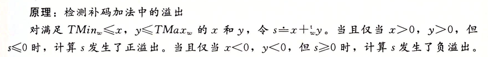

 无符号数与有符号数(补码)的四则运算1
===

学习了无符号数与补码的表达之后,就要到了讨论他的四则运算的时间了.

===

### 无符号数和补码的截断

在讨论四则运算之前,我们先讨论截断.因为在四则运算中很可能出现溢出的问题.在当前的C语言中,我们采用截断的办法来处理溢出.

对于一个w为的数:
, 我们将他截断为k位的数字,我们会丢弃高位的w-k位.得到位向量:.

通过上面的讨论.我们得到关于无符号数和补码的截断的定理.

原理1:关于无符号数的截断

原理2:关于补码的截断

### 无符号数的加法和减法

对于两个w位的无符号数相加,总会产生一个w+1的和.对于C这种只支持定长的加法的办法,我们需要一个使用截断来处理溢出情况的加法.因此我们在这里给出一个定义.

通过定义我们就得到了定精度下的无符号数加法

那么我们什么时候可以知道发生了截断了呢.

对于减法我们需要一个加法的逆元

- 无符号数的减法

规定完逆元后我们就可以进行减法运算.我们定义y-x他等于y加上x的逆元.
在上面的情况中当|x|<y时就变2^w+|x-y|,这是一个大2^w这时候就出现了截断.对于无符号数的加法,截断是采用mod 2^32.也就等于y-x

当|x|>y.我们有y-x = 2^w-|x-y|.

### 补码的加法

首先我们依旧讨论加法,减法根据之前一样,只需要讨论和逆元的加法就等于减法即可.

我们依旧要考虑加法的截断的问题.

通过考虑截断的情况我们可以类比之前得到无符号的加法情况进行类比,自己上只是把只是不考虑符号位的情况下,无符号的加法的向量加法是等同于与补码的加法.这里我们可以推导出公式:

上图中我们先给出补码加法的定义,之后就给出了公式
同样的我们亦可以给出推倒什么情况下发生溢出.

我在这里给出证明.为了方便书写我们这里定义n=2的w次幂
- 首先是什么时候发生溢出
当且仅当x>0,y>0发生溢出,因为如果x,y一正一负,二者的和必然小于二者的最大值,大于二者的最小值.因此不可能发生溢出.
- 讨论正溢出的情况  如果是正溢出,必然有x>0,y>0,我们知道如果发生了截断,必然有二者的和等于x+y-n.又因为x,y<2的w-1次幂,我们有x+y<n,所以s<=0.通过定义我们可以得出,当x+y=2的w-1次幂是,s=0.

同理我们也可以证明负溢出

### 补码的逆元和减法

再次我们给出证明.
- 当x!=0,且x!= TMix时候,-x即他的负数的补码表达,二者的和等于0.不会发生溢出,也不可能有多个解.
- 当x=0时候逆元必然为0.
- 当x=Tmix时候.他的负数,会超过w位的补码的最大字.因此不能考虑-x.我们考虑他的自身,二者之和会发生负溢出.二者之和等于负的2的w次幂.溢出后根据公式213,我们出结论二者的和等于0.
