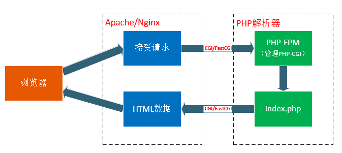

从浏览器输入URL会发生什么2?FPM(FastCGI Process Manager)概述
===
---

在之前的文章中我们稍微提到了了cgi和fastcgi在服务器端响应请求.作为一个php程序员,必然要学习fpm,在现在lnmp架构下fpm几乎成了必然使用的地方,所以写下本片博客,作为一个概述,粗略的讨论fpm.更详细的内容,请参考[官网](https://php-fpm.org/).

---
===

### cgi AND fast CGI
首先我们给出一个cgi和fast cgi的定义:
- CGI:是 Web Server 与 Web Application 之间数据交换的一种协议.
- FastCGI:同 CGI，是一种通信协议，但比 CGI 在效率上做了一些优化。同样，SCGI 协议与 FastCGI 类似。

在服务器请求中他的作用如下图:

FastCGI是一种让交互程序与Web服务器通信的协议。FastCGI是早期通用网关接口（CGI）的增强版本。

### fpm

聊完了cgi和fastcgi,我们来说说phper程序员经常接触的fpm.我们先看一看官方的文档中提到的[定义](https://secure.php.net/manual/zh/install.fpm.php).

PHP-FPM (FastCGI Process Manager) is an alternative PHP FastCGI implementation with some additional features useful for sites of any size, especially busier sites.

换成汉语FPM（FastCGI 进程管理器）用于替换 PHP FastCGI的一个实现,并附带了大量对于高负载网站是非常有用的附加功能，(ps这个翻译和官方翻译不一样,我觉得这样翻译会更合适,官方的汉化翻译有明显不对劲).

它具有一下特点:
- 支持平滑停止/启动的高级进程管理功能；
- 可以工作于不同的 uid/gid/chroot 环境下，并监听不同的端口和使用不同的 php.ini 配置文件（可取代 safe_mode 的设置）；
- stdout 和 stderr 日志记录;
- 在发生意外情况的时候能够重新启动并缓存被破坏的 opcode;
- 文件上传优化支持;
- "慢日志"(slowlog) - 记录脚本（不仅记录文件名，还记录 PHP backtrace 信息，可以使用 ptrace或者类似工具读取和分析远程进程的运行数据）运行所导致的异常缓慢;
- fastcgi_finish_request() - 特殊功能：用于在请求完成和刷新数据后，继续在后台执行耗时的工作（录入视频转换、统计处理等）；
- 动态／静态子进程产生；
 基本 SAPI 运行状态信息（类似Apache的 mod_status）；
- 基于 php.ini 的配置文件(在lnmp下通常是fastcgi.conf)。

另外说一点,前两天看到一个面试题提到几个有趣的点.第一,fpm是一个进程池管理器(FastCGI pools,用官方的说法就是一个fastcgi池子),他可以配置多个进程池.第二,默认状态下fpm的默认端口是9000.
