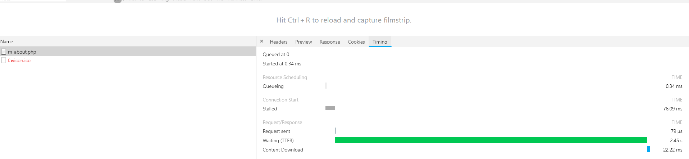
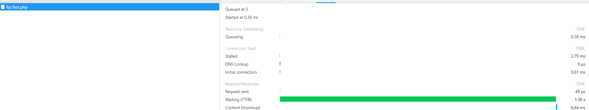
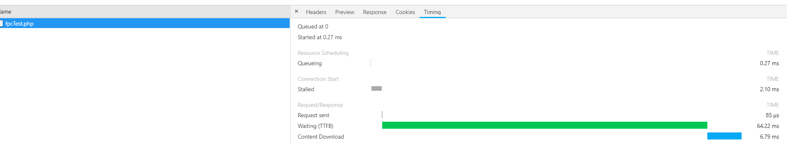

php redis 实现全页缓存系统
===
---

之前的一个项目说的一个功能,需要在后台预先存入某个页面信息放到数据库,比如app的注册协议,用户协议,这种.然后在写成一个php页面,app在调用接口的时候访问这个页面.当时我就发现一个问题,这些协议往往几个月才会修改一次,而每一次用户查看这些协议的时候,nginx都会重新从数据库读取文件,速度会很慢慢了.

如下图m_about.php是我生成的数据页,



在虚拟机环境下从数据库加载出来重新生成文件需要2.4s(当然实际的测试环境会快一点).

既然这种页面数据都是更新少,为什么不缓存起来呢,想到之前看的redis常用应用里面有一个全页缓存系统(full page cache).不如写一个试试看.

---


### 代码思路

redis使用的是[phpredis扩展](https://github.com/phpredis/phpredis),当然你也可是用predis扩展,只不过需要更改里面几个读取函数而已.

关于缓存系统的接口,我这里参考了laravel里面cache系统.这个系统的设计接口我觉得设置的很清晰,里面不只是包含redis,还可以使用文件,mysql,memcache.

当然全页缓存用不到那么多东西.只是借用他的函数设计.首先是函数getUrlText,这个是获取全页面的数据,这里没有想到太多,直接使用file_get_contents,当然你也可以改写成curl函数
```
/**
     * 获取对应的url的信息
     * @param string $url 对应的地址
     * @return boolean|string
     */
    public function getUrlText($url)
    {
        if (empty($url)) {
            return false;
        }
        return  file_get_contents($url);

    }
```

其次是几个借鉴cache系统的函数,remember函数,记忆缓存,这个是对外的最重要的接口,一般在缓存系统里面直接使用它就好.

```
/**
   * 记录对应的缓存,如果之前存在则返回原本的缓存
   * @param string $cacheName 缓存名
   * @param string | callback $urlOrCallback 需要缓存的数据地址.可以是一个 网页地址也一个可回调类型,如果不是可回调类型,则判定是一个网址
   * @param null | int $ttl 缓存过期时间,如果不过期就是用默认值null
   * @throws \Exception 如果无法访问地址
   * @return boolean|string 缓存成功返回获取到的页面地址
   */
  public function remember($cacheName, $urlOrCallback, $ttl = null)
  {
      $value = $this->get($cacheName);//检查缓存是否存在
      if (!$value) {
          //之前没有使用键
          if (is_callable($urlOrCallback)) {
              $text = $urlOrCallback();
          } else {
              //如果不是回调类型,则尝试读取网址
              $text = $this->getUrlText($urlOrCallback);
          }

          if (empty($text)) {
              throw new \Exception('can not get value:' . $urlOrCallback);
          }
          $this->put($cacheName, $text, $ttl);
          return $text;
      } else {
          return $value;
      }

  }
```

refresh函数,刷新缓存函数,如果缓存页面被更新了,就去刷新它.
```
/**
 * 更新缓存,并返回当前的缓存
 * @param string $cacheName 缓存名
 * @param string | callback $urlOrCallback 需要缓存的数据地址.可以是一个 网页地址也一个可回调类型,如果不是可回调类型,则判定是一个网址
 * @param null | int $ttl 过期时间,如果不过期就是用默认值null
 * @return boolean|string 缓存成功返回获取到的页面地址
 */
public function refresh($cacheName, $urlOrCallback, $ttl = null)
{
    $this->delete($cacheName);
    return $this->remember($cacheName, $urlOrCallback, $ttl);
}
```
剩下的两个代码文件.一个是[redisFPC.php](10-24/redisFPC.php),这是全页缓存的demo,一个是测试用的文件
[fpcTest.php](10-24/fpcTest.php)

### 测试

我们在这里测试,第一次加载因为需要读取对应的m_ahout的信息,所以慢一点



第二次加载因为从redislimian 读取了,所以会快的多


### 使用建议

代码我认为已经给了足够多的接口了,在第一次缓存的时候使用remember函数记录缓存,之后如果缓存变化后使用refresh函数,更新缓存即可.如果可能的话,尽量使用ttl设置缓存的过期时间.
