无符号数 有符号数 与 补码
===

本文是深入理解计算机系统这本书里面关于补码有符号数无符号数章节的一个摘要和读书报告,我个人认为这本书关于这一段的表述,要比绝大多数网上的博客甚至是国内教材要深入浅出的多.同时由于markdown的文档表示公式很麻烦,本文将大量使用书中的截图作为公式使用.

===

### 无符号数
书中采用一个函数B2U w(binary to unsign ,二进制向量长度为w)将一个二进制向量转化为无符号数.
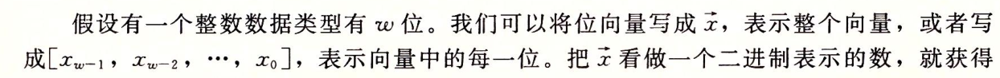
我们现在给出定义
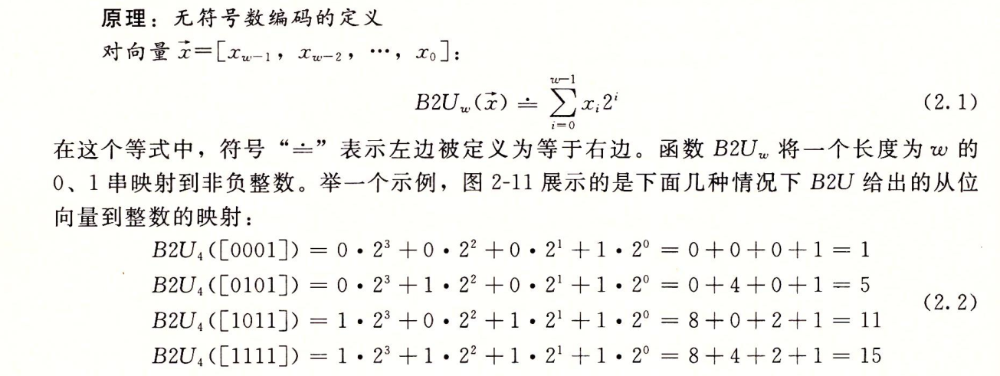
要注意上面的这个函数,他是双射的,也就是说无符号数的编码是唯一的.当然大前提是在w即长度是固定的情况下.

在无符号数中,最小值是0,最大值
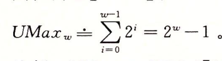
### 补码
在补码定义中最关键的是最高位被解释为负权,也就是说当他是1的时候,这个数就是负数了.同样的我们也引用B2T w(binary to two's-complement,二进制向量长度为w)作为函数来定义.
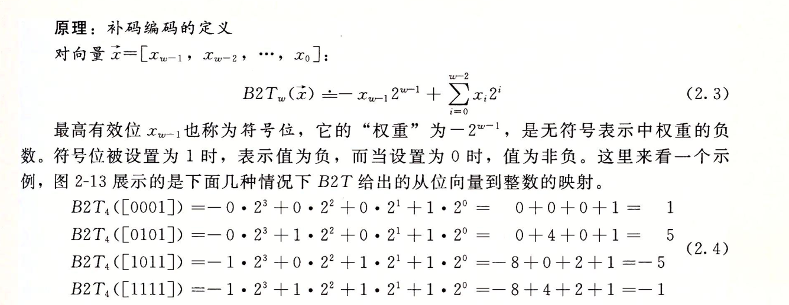

对于补码而言,他也是双射的.当然这里我就不给出证明了.
他的最小值是位向量[1.....0],

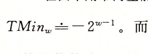

而最大值,这是[01....1]

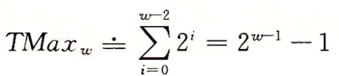

在这里我们可以看到补码的不对称性,即|TMix w| = |TMax w| + 1.这一点会造成补码运算的某些特性,并对于计算机程序造成特殊的bug.

最大的无符号数刚好是补码最大值的的两倍还大一.即UMax w = 2TMax w + 1.

有趣的是C语言并没有定义一定要使用补码表示有符号数,然而几乎所有的现代机器都是用补码.
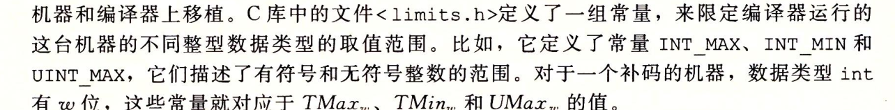

### 原码 反码

原码表示法在数值前面增加了一位符号位（即最高位为符号位）：正数该位为0，负数该位为1（0有两种表示：+0和-0），其余位表示数值的大小.我们使用函数B2S w(binary to sign-magnitude)来定义

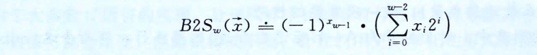

反码(one's complement)也同样适用符号位.正数的反码与其原码相同,负数的反码是对其原码逐位取反.我们也使用函数B2O w来定义
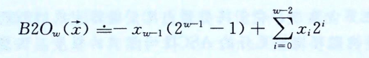

对于反码我们可以得到他的最大最小值刚好是共轭的.最大值是(2的 w-1次幂 -1) 最小值是(负的2的 w-1次幂 -1)

在某些教材中习惯于先从原码反码开始说起,在引入补码,这是因为为了让学生有跟直观的了解.因为补码的计算是不直观的,引入原码和反码之后计算补码会直观的多.

正整数的补码是其二进制表示，与原码相同.

求负整数的补码，将其对应正数二进制表示所有位取反（包括符号位，0变1，1变0）后加1(但是不允许影响符号位).i

上述的表述虽然是不严谨的,没有计算机数学应该有的严谨性,却是非常直观的.
不过在由于在计算机历史上还没有直接使用原码的机器(但是却用原码来表述浮点数),也只有少数几种机器使用反码,而现代的计算机基本都是使用补码来表示有符号数.

### 有符号数 无符号数 的转换
在c语言中我们有有符号数与无符号数的强制转化.由于二者的最大最小值是不同,为了避免出现位值不够的情况,我们的转化采用的是位模式不变,只改变数值的办法.右下图我们可知对于0xCFC7的16进制数而言,表示为补码-123456,又可以表示为无符号数53191,因此二者之间可以进行转化

我们可以通过推倒得到对于补码有符号数转化为无符号数,我们得到两个公式

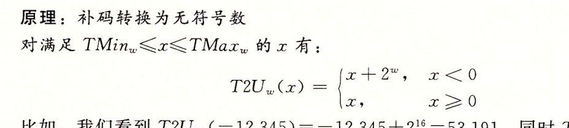

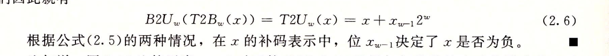

无符号数转化为补码的有符号数,我们得到两个公式
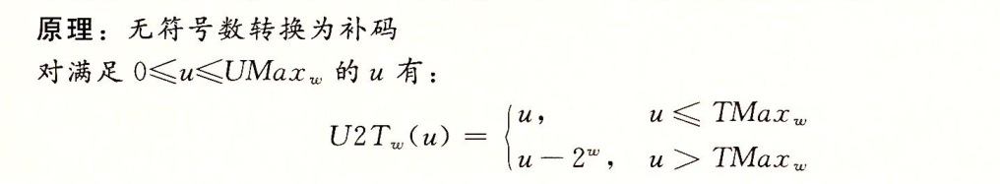

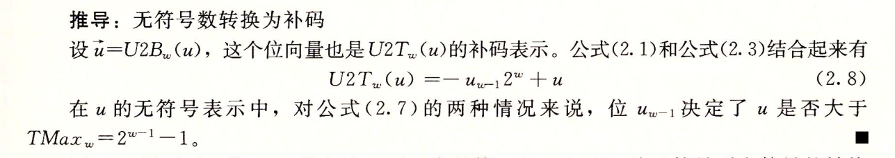

### c语言的转换

由于C语言对同时包含有符号和无符号数表达式的这种处理方式,出现了一些奇特的行为。当执行一个运算时,如果它的一个运算数是有符号的而另一个是无符号的,那么C语言会隐式地将有符号参数强制类型转换为无符号数,并假设这两个数都是非负的,来执行这个运算。就像我们将要看到的,这种方法对于标准的算术运算来说并无多大差异,但是对于像<和>这样的关系运算符来说,它会导致非直观的结果。图2-19展示了一些关表达式的示例以及它们得到的求值结果,这里假设数据类型int表示为32位补码。考虑比较式-1<0U。因为第二个运算数是无符号的,第一个运算数就会被隐式地转换为无符
虑比较式-1<0U。因为第二个运算数是无符号的,第一个运算数就会被隐式地转换为无符号数,因此表达式就等价于4294967295U<0u(回想T2U2(-1)=UMax),这个答案显然是错的。

