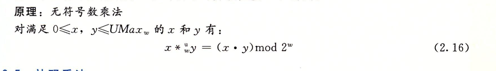
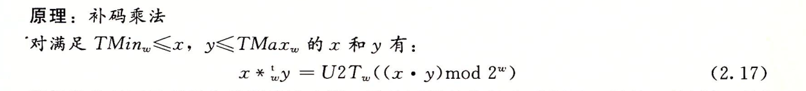
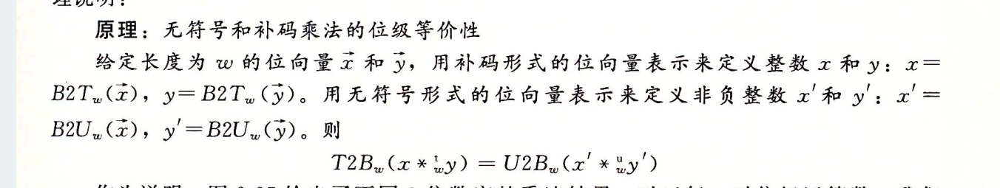
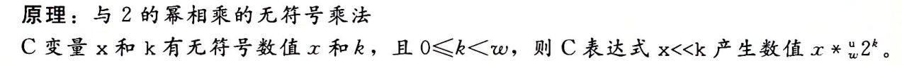
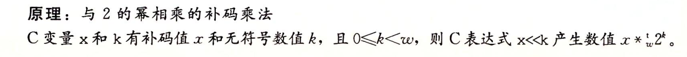
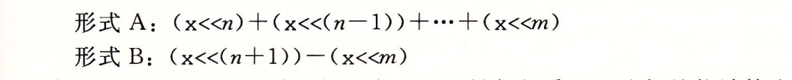

 无符号数与有符号数(补码)的四则运算2
===

本文是深入理解计算机系统这本书里面关于补码有符号数无符号数章节的一个摘要和读书报告,我个人认为这本书关于这一段的表述,要比绝大多数网上的博客甚至是国内教材要深入浅出的多.同时由于markdown的文档表示公式很麻烦,本文将大量使用书中的截图作为公式使用.

本文主要描述无符号数和补码的乘除法

===

### 无符号数和补码的乘法

与加法类似,无符号数和补码都要考虑到截断的问题,而一旦考虑截断后,二者的值都是类似的.

无符号数乘法

补码乘法

然而虽然二者截断之后结果一直,但是实际的截断前的结果却是不一致的,比如我们那三位数举列.5[101] * 3 [011] = 15[001111],截断后等于7[111].而对应的补码-3[101] * 3[011] = -9[110111]截断后等于 -1[111].

### 乘以常数
对于绝大多数的机器而言,使用乘法的指令很慢,因此我们对于整数乘法.考虑使用移位运算与加减法预算进行替换.

首先我们需要了解到对于无符号数和补码,他们的乘以2的几次幂都等于对应的左移位.

当然几遍考虑移位运算我们也要考虑到对应的截断的问题.

我们考虑使用加减法和移位预算来来代替常规的乘法.比如A*14 = 16A - 2A = A<<4 - A <<1.类似的我们都可以吧乘以常数拆分成对应的移位和加减法.

