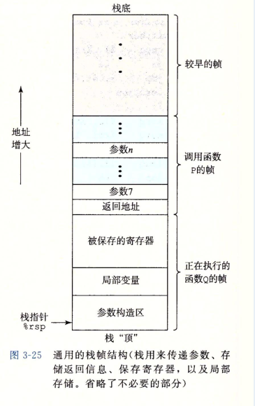
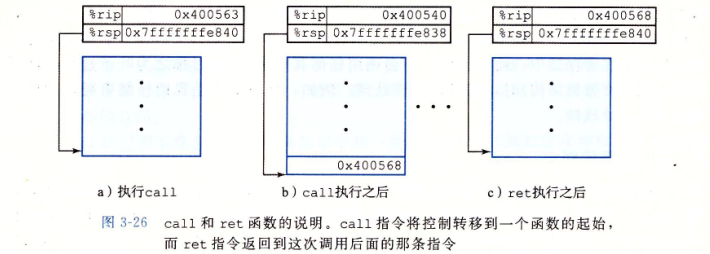
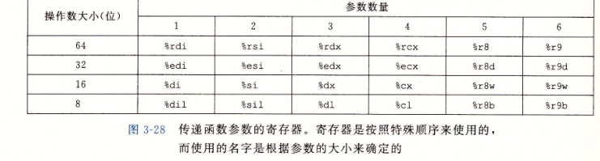

函数与运行时的栈
===
---

函数作为语言中最常见的代码封装方式,是软件中最重要的一种抽象.(当然在不同语言中叫法也可能不同,比如叫函数function,叫方法method,处理函数handle),而在函数的使用中,一个最为重要的特性就是使用了操作系统提供的内存栈作为先进后出的内存管理机制.通过了解函数调用和栈的关系,我们也能够窥视到操作系统对于内存的控制.

---
### 函数机制

在这里面们做出讨论,假设函数P调用函数Q, Q执行后返回到P.这些动作包括面一个或多个机制：
- 传递控制.在进人函数Q的时候,程序计数器必须被设置为Q的代码的起始地址,然后在返回时,要把程序计数器设置为P中调用Q后面那条指令的地址.
- 传递数据.P必须能够向Q提供一个或多个参数,Q必须能够向P返回一个值4
- 分配和释放内存.在开始时,Q可能需要为局部变童分配空间,而在返回前,乂必须释放这辟存储空间.

### 寄存器
首先还是要提一下寄存器,编译器总会优先使用高速的寄存器,现代CPU有一系列的寄存器.而在无法使用寄存器的情况下(比如超过寄存器大小的数组时候),择需要调用栈内存.如果还需要动态分配内存,甚至需要分配堆内存(heap memory.当然堆内存不在本文讨论的范围).

### 栈帧 stack fram
当存储空间超过寄存器能够存放大小时候,操作系统就会在栈上分配空间,这个工程称之为函数的栈帧,当P调用Q时候,控制和数据信息添加到栈尾.当p返回时,栈会释放之前保存的Q的信息.当前的函数总是在栈顶.
一下为栈帧的架构,注意栈的生长方向.

如图所示.我们总是需要返回地址,当Q返回时候我们需要知道P函数的之前的栈顶位置.大多数情况下函数栈帧代销是固定的,不过也会需要边长的栈帧.比如我们需要一个通过函数传递参数的可变长数组.int p[n];当前的变量需要8n大小的栈.'

通常下函数只分配自己需要的栈帧,因此许多有六个一下的参数,完全可以只是用寄存器,而不是栈帧来保存参数.

###  转移控制
将控制从函数 P转移到函数 Q只需要简单地把程序计数器 (PO设置为 Q的代码的起始位置.不过,当稍后从Q返回的时候,处理器必须记录好它需要继续P的执行的代码位置.在X86-64机器中,这个倍息是用指令call Q调用函数Q来记录的,该指令会把地址A压入栈中,并将 PC设置为 Q的起始地址.压人的地址 A被称为返回地址,是紧跟在 call指令后面的那条指令的地址.对应的指令ret会从栈中弹出地址A,并把PC设置为A.

在下图中我们给出了一个函数调用,从main调用了函数mulstore,在mulstore结束后返回了main.注意已栈指针%rsp和程序计数器%rip(程序计数器也叫PC,用于存放下一条指令所在单元的地址的地方)

我们分析这个函数.在 main函数中,在PC地址为0x400563的 call指令调用函数 multstore.指明了栈指针%rsp叩和程序计数器%rip的值.call的效果是将返冋地址0x400568压入栈中,并跳到函数 multstore的第一条指令,地址为0 x0400540 函数 multstore继续执行,直到遇到地址0 x40054 处的
ret指令.这条指令从栈中弹出值0x400568,然后跳转到这个地址,就在 call指令之后,继续main函数的执行.

### 数据传送

在X86/64体系下,.如下图所示,函数会根据参数在参数列表的顺序为参数分配寄存器.函数最多通过寄存器使用6个参数,多出的部分就要使用栈了

除此之外一下情况也要使用栈保存数据

- 对一个局部变M使用地址运算符‘&’,因此必须能够为它产生一个地址
- 某些局部变世是数组或结构,因此必须能够通过数组或结构引州被访问到.

这些数据被称为局部变量.在函数调用函数中,也会保存在栈中,并在返回后重新使用.

### 寄存器中的局部存储空间

寄存器作为所有函数共享的资源,在函数调用函数中也要被保存不会被调用者覆盖.根据惯例,寄存器%rbx、%rbp和%r12~%r15被划分为被调用者保存寄存器.当函数P调用函数 Q时,Q必须保存这些寄存器的值,保证它们的值在Q返回到 P时与Q被调用时
是一样的.函数Q保存一个寄存器的值不变,要么就是根本不去改变它,要么就是把原始值压入栈中.改变寄存器的值,然后在返回前从栈中弹出旧值.压入寄存器的值会在栈帧中创建标号为“保存的寄存器”的一部分,.有了这条惯例,P的代码就能安全地把值存在被调用者保存寄存器中（当然,要先把之前的值保存到栈上）,调用Q,然后继续使用寄存器中的值,不用担心值被破坏.

所有其他的寄存器,除了栈指针%rsp,都分类为调用者保存寄存器,这就意味着任何函数都能修改它们.可以这样来理解“调用者保存”这个名宇：函数P在某个此类寄存器中有局部数据,然后调用函数 Q.因为 Q可以随意修改这个寄存器,所以在调用之前首先保存好这个数据是P(调用者）的责任.
