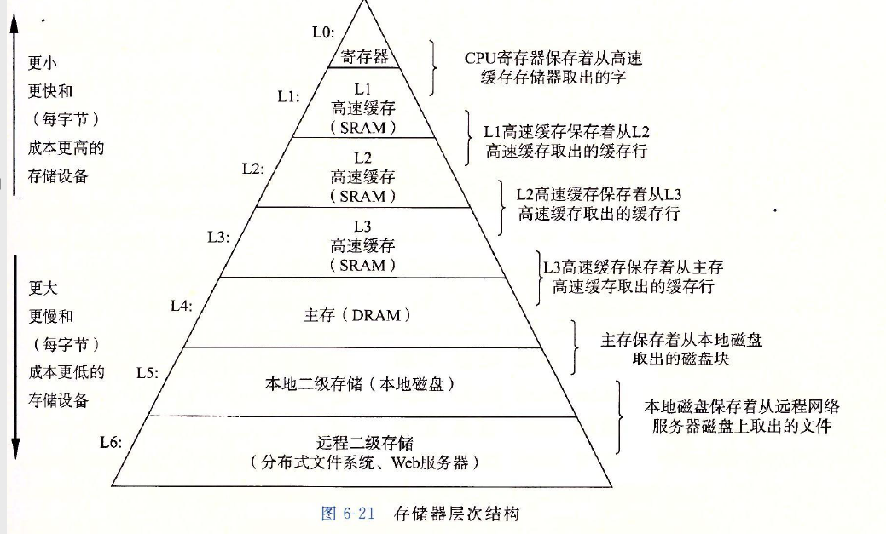
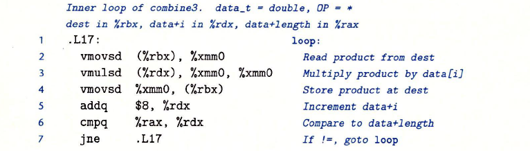
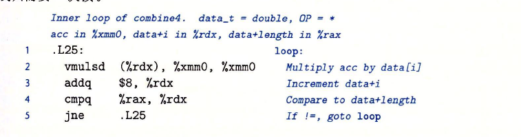
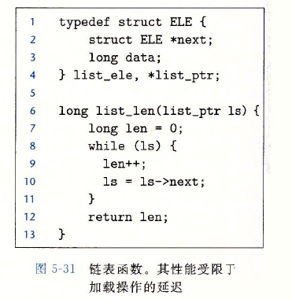
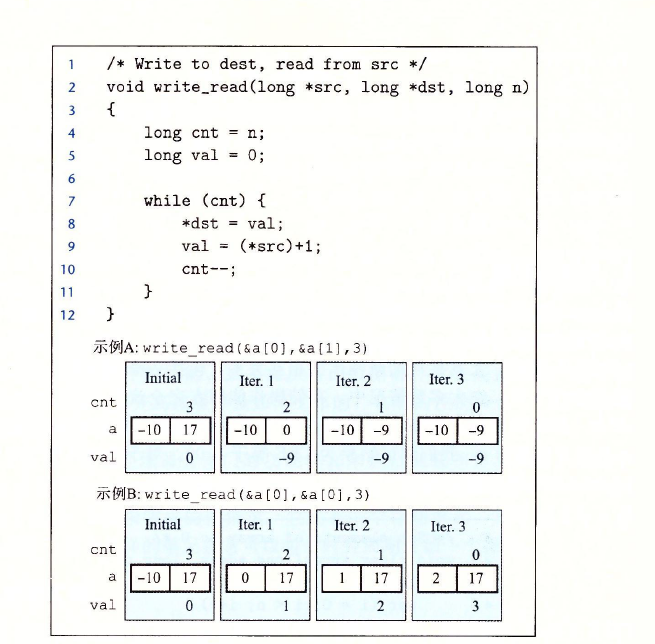

代码优化3:优化内存访问
===
---

终于到达了第三篇了,本文的内容比较偏向于底层与系统结构这一块的内容,使用C和汇编作为语言进行说明.

---

### 分层结构

众所周知的我们知道计算机的存储是分层次的,存储系统是具有不同的速度,容量和成本的访问系统.越靠近CPU,他的访问数据就越快,容量也越低.整个体系结构中寄存机最快,各级缓存紧随其后,内存比较快,但是容量也较为大,现在通用PC的内存可以到8g,服务器甚至可以有128g这样的超大内存,之后就是更慢的磁盘.

通常情况下寄存器的数目是有限的,无法无限放置在内存器中,如果寄存器使用过多会造成溢出,系统会将多出来的内容放置于内存中(或者缓存中).至于寄存器的数目这要看具体的cpu的类型.不过通用的寄存器就那些,有兴趣的请自行维基.

虽然我们知道各级高速缓存的存在,甚至也知道常用的缓存算法(LLU LRU),但是在写代码的时候我们是不知道变量是否会放置在缓存内的.通常情况下在考虑内存访问优化的时候我们只考虑寄存器-内存 二级.



### 操作数保存方式
通常情况下我们知道变量有三种保存方式.
- 立即数 直接表示常数,通常汇编器会用最紧凑的方式进行数字编码
- 寄存机 直接放置在寄存器中,通常的变量,函数的参数都会采用这一类的方式
- 内存寻址 包括绝对寻址,相对寻址,变址寻址等.通常情况下,指针,数组访问都是采取内存寻址

### 消除不必要的内存访问
有了上面的先置知识.我们就可有聊一聊如何优化代码.
首先是消除不必要的内存访问.

给出下面一个代码,我们在之前讨论循环优化的时候用到过的

```
void combine3(vec_ptr v, data_t *dest)
{
	long i;
	long length = vec_length(v);

	data_t *data = get_vec_start(v);
  *dest = 1;
	for (i = 0; i < length; i++) {
		*dest = *dest * data[i];
	}
}
```

	我们注意到这一段代码
  ```
  *dest = *dest * data[i];
  ```
  可以看到这是一组内存访问,我们现在使用汇编查看,我们假设data_t 是double



我们可以看到每一次循环都要从内存中读取dest,乘以data[i],后在保存会内存中.我们完全可以引入一个临时变量,将数据保存到寄存器中.

```
void combine3(vec_ptr v, data_t *dest)
{
	long i;
	long length = vec_length(v);
  long acc = 1;
	data_t *data = get_vec_start(v);

	for (i = 0; i < length; i++) {
		acc = acc * data[i];
	}
  *dest = acc;
}
```

我们可以看看汇编码


由于寄存器的使用,大量的减少的内存的访问.因此我们可以得出结论,通过使用临时变量,保存中间的结果,之后再最后再把结果返回到数组或者结构中.可以减少内存的访问,

### 依赖结果与读写相关
我们知道由于流水线技术的存在,在大多数的循环中,cpu可以高速的读取或者存储数据

在高速读取数据中,cpu可以提前读取结果,一边备用,但是存在一类情况,无法持续的流水线读取,那就是下一次循环的结果仰赖于这一次读取的结果.如同下面的链表操作.


同事有一种情况,即每一次读取的情况都仰赖于上一次写入的情况,我们称之为读写相关.考虑下面的代码



由于操作器的读写寄存器存在读写相关,因此会无法形成流水线数据流.
在这里我们要明确一定,那就是编译器是不足够智能的,他是无法知道两个指针中是否可能指向同一个地址的.因此无法很好的优化代码.
