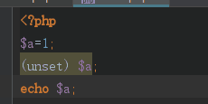
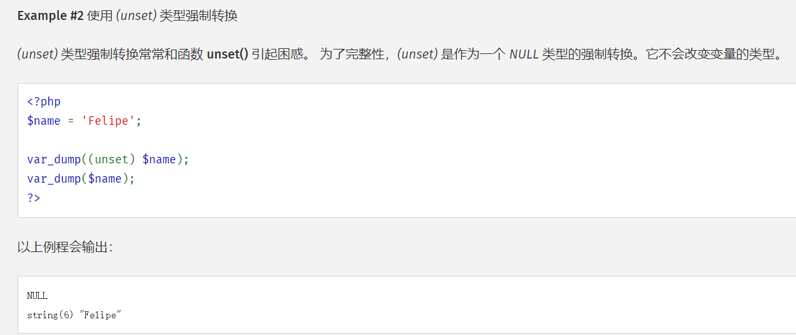
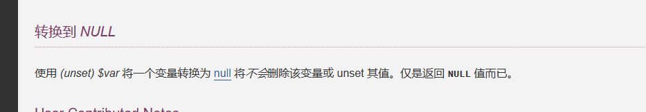

从源代码级别的角度看php var_dump和echo的区别
===

----
上周五同事出了一道有趣的题目,题目是这样:



答案很神奇是1,而一旦把echo替换成了var_dump,则这是一个null.根据文档我们可以看到unset转换





当然是什么造成echo和var_dump的区别呢,这就要从源代码级别进行讨论了.本文并不会像某些文章一些罗列大量的二者的区别,想要看这种面试题,请自行打开搜索引擎.

### 变量的源代码
在这里我们查看官网中关于变量的解释,很幸运,我们这里可以直接看到c的代码,而不是需要在工程中搜索.
```
typedef struct _zval_struct zval;

struct _zval_struct {
     union {
          long lval;
          double dval;
          struct {
               char *val;
               int len;
          } str;
          HashTable *ht;
          zend_object_value obj;
          zend_ast *ast;
     } value;
     zend_uint refcount__gc;
     zend_uchar type;
     zend_uchar is_ref__gc;
};
```

看完源代码我们猜测unset转换可能只改了type,而没有改变其他的东西.

### echo的源代码

网上有这一类的文章 ,我个人选出了一篇不错的文章出来
[深入理解PHP原理之－－echo的实现](https://www.kancloud.cn/qinfengyan/study/121837)

```
ZEND_API int zend_print_zval_ex(zend_write_func_t write_func, zval *expr, int indent)

{
zval expr_copy;

int use_copy;

zend_make_printable_zval(expr, &expr_copy, &use_copy);

if (use_copy) {

        expr = &expr_copy;

}

if (expr->value.str.len==0) { /* optimize away empty strings */

        if (use_copy) {

                zval_dtor(expr);

        }

        return 0;

}

write_func(expr->value.str.val, expr->value.str.len);

if (use_copy) {

        zval_dtor(expr);

}

return expr->value.str.len;
}
```

核心在这一段write_func(expr->value.str.val, expr->value.str.len);

write_func并不复杂,实际上只是一个字符串读取函数.因此我们可以看出他是直接去读取zval下面的联合下的支付串,而不会去干其他的事情.

### var_dump的源代码
var_dump的源代码网上并没有代码的文章,不过可以看这一篇[如何在php源代码中找寻函数](https://segmentfault.com/q/1010000003009774).
通过在下载的源代码中查找PHP_FUNCTION(var_dump),找到函数的实现.

我们在etc/standard/var.c中查找了实现

```
PHP_FUNCTION(var_dump)
{
	zval *args;
	int argc;
	int	i;

	if (zend_parse_parameters(ZEND_NUM_ARGS(), "+", &args, &argc) == FAILURE) {
		return;
	}

	for (i = 0; i < argc; i++) {
		php_var_dump(&args[i], 1);
	}
}
```

我们再看php_var_dump的代码

```
switch (Z_TYPE_P(struc)) {
	case IS_FALSE:
		php_printf("%sbool(false)\n", COMMON);
		break;
	case IS_TRUE:
		php_printf("%sbool(true)\n", COMMON);
		break;
	case IS_NULL:
		php_printf("%sNULL\n", COMMON);
		break;
	case IS_LONG:
		php_printf("%sint(" ZEND_LONG_FMT ")\n", COMMON, Z_LVAL_P(struc));
		break;
	case IS_DOUBLE:
		php_printf("%sfloat(%.*G)\n", COMMON, (int) EG(precision), Z_DVAL_P(struc));
		break;
	case IS_STRING:
		php_printf("%sstring(%zd) \"", COMMON, Z_STRLEN_P(struc));
		PHPWRITE(Z_STRVAL_P(struc), Z_STRLEN_P(struc));
		php_printf("\" refcount(%u)\n", Z_REFCOUNTED_P(struc) ? Z_REFCOUNT_P(struc) : 1);
		break;

    ........
```

我们可以看到在打印之前会检查type类型也就是上文提到了zend_uchar type,在之后根据类型打印,而不是直接打印字符串后在判断类型,这也是本文开头的两组代码的区别原因.
