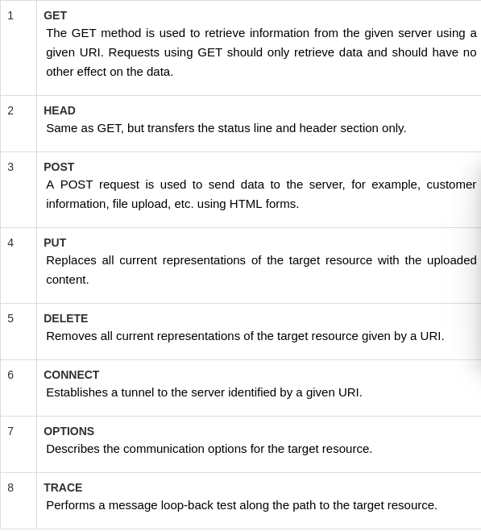
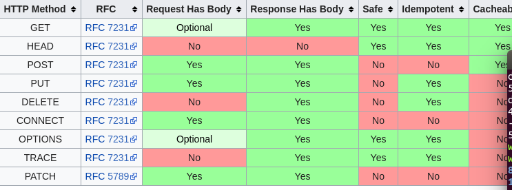
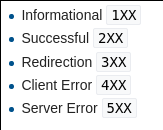

从浏览器输入URL会发生什么?从浏览器控制台了解http协议
=========
## 方法与消息头

其实本篇的重点其实跟放在API上面用的比较多,反而和浏览器的关系不大,不过既然都是一个系列也就厚颜无耻的写同一组标题好了

http的方法(method)根据官方文档的描述使用来扩展http的操作的,用于表示某一次请求的操作. 
根据官方文档[rfc2616-section9](https://www.w3.org/Protocols/rfc2616/rfc2616-sec9.html)的描述,在http1.1中给了8种方法,并且允许之后继续扩展.8种方法如下图1
 

图1

### POST 和 GET方法
本来不打算写一个段,但是写这篇文章的时候自然而然的想到了当初面试时候的一道日精题post和get方法的区别.特地参考了一些文章写下这一段. 
实际上根据我们上面的图片和官方文档的定义,post方法和GET方法的区别只是在语意上区分.GET方法只是用来从服务器上面拉取数据.而POST方法只是用来上传数据到服务器(比如表单)
通常而言,早期的框架下是只支持GET和POST两种HTTP方法，而不支持PUT和DELETE方法.(比如我现在这一家公司).所以在老的面试题里面很喜欢问这一个问题.不过随着架构的发展，现在出现REST(Representational State Transfer)，一套支持HTTP规范的新风格.
- GET请求的数据会附在URL之后（就是把数据放置在HTTP协议头中），以?分割URL和传输数据，参数之间以&相连.这也就有一个引申一个常见的回答这一类博客中常见错误.指出GET方式提交的数据最多只能是1024字节,实际上这个问题是博客届一大抄的后遗症,实际上根据官方文档是没有限制URL的长度的,而这个1024字节我怀疑是某个早期版本IE的输入框限制,实际上现代浏览器已经很早去除URL长度限制.而真正影响URL长度的取决于客户端操作系统中限制(比如API)和服务器上的限制.
- POST是没有大小限制的，HTTP协议规范也没有进行大小限制，说“POST数据量存在80K/100K的大小限制”是不准确的，POST数据是没有限制的，起限制作用的是服务器的处理程序的处理能力。
- POST的安全性通常要比GET的安全性高。这主要值得是GET请求通常会被浏览器放到浏览历史中(其实是看个人设置),而服务器也喜欢把GET请求放到日志中(这还是看服务器运维设置).至于数据的安全性其实区分不打,GET参数和post参数一样可以被加密,其实区别不大.

在维基上有一张更详细的中总图 

### rest(Representational State Transfer)
上文我们提到rest其实是一套针对API的一种设计风格
- 资源是由URI来指定。
- 对资源的操作包括获取、创建、修改和删除资源这些操作正好对应HTTP协议提供的GET.POST,PUT和DELETE方法。
- 通过操作资源的表现形式来操作资源。
- 资源的表现形式则是XML或者HTML,取决于读者是机器还是人,是消费web服务的客户软件还是web浏览器.当然也可以是任何其他的格式. 
当然这些本文也是泛泛而谈,等到以后有时间设计对应API的时候我们再来聊这些东西.

### 状态码
状态码树http1.1中放置在响应头(response head)的第一行的数字用于表示响应的请求状态. HTTP状态代码主要分为五组，以便更好地解释客户端和服务器之间的请求和响应 

 
通常而言我们在浏览器中看到错误码4XX 5XX系列.不过还是要说说我认为比较常见的一些状态码.
- 200 服务器正确处理请求,这个最常见的状态
- 206 由于客户端发送的范围标题，服务器仅传递部分资源(字节服务) HTTP客户端使用范围标题来启用中断下载的恢复，或将下载分割为多个同步流.通常在分段上传或者分段显示图这一类中请求中常见
- 404 服务器无法请求到资源,也可以在服务器端拒绝请求且不想说明理由是使用
- 500 服务器请求错误,比如写PHP代码有bug而关闭了错误提示的时候就会响应这个
- 502 作为网关或者代理工作的服务器尝试执行请求时,从上游服务器接收到无效的响应. 
