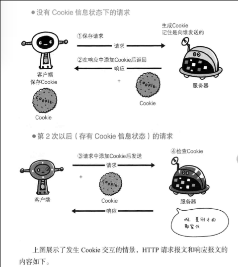
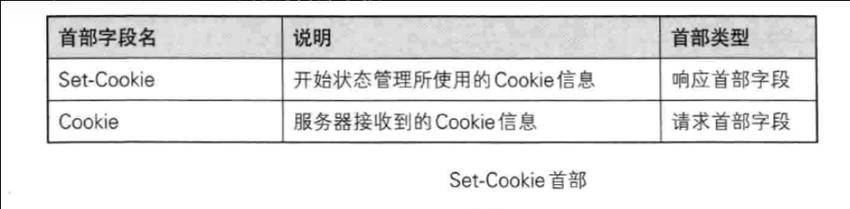
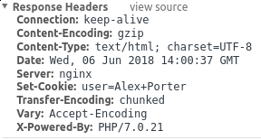
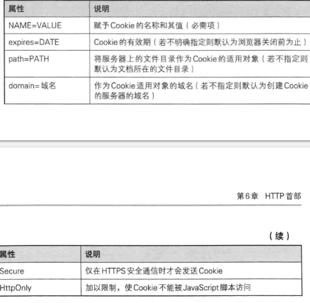
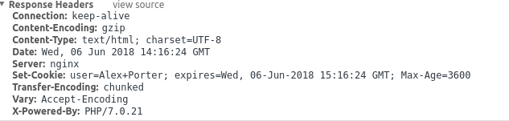
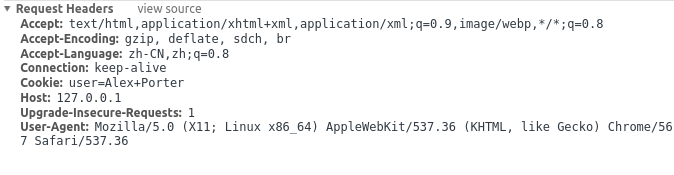

从浏览器输入URL会发生什么?
=====
番外篇 cookie机制
======
---
cookie是服务器放置在客户端(浏览器控制)的小段数据.用维基的标准说法就是An HTTP cookie (also called web cookie, Internet cookie, browser cookie, or simply cookie) is a small piece of data sent from a website and stored on the user's computer by the user's web browser while the user is browsing. 
前面提到http机制是架构在无状态协议基础上的,换而言之每一次http请求都是独立的,因此需要一种机制来保存之前请求的信息.因此cookie就被设计出来解决这个问题. 
服务器给浏览器发送cookie,浏览器保存cookie,等到下一次请求浏览器就会把对应的cookie发送过来,服务器就知道cookie的信息了. 

图-1
上面这张图来自<图解http>很不错的一本好书

### http首部字段与cookie

cookie机制仰赖与http的请求头,使用两种请求头set-cookie头和 cookie头来实现cookie机制

图-2 

如图-1所示服务器代码觉得有必要设置一个cookie了,这时候就会发送一个set-cookie头给浏览器,之后浏览器就会保存这个cookie,并将这个cookie和当前这个域名绑定,等到下一次浏览器请求这个 域名的时候浏览器就会把这个cookie放置在cookie头中返回到服务器上,这样服务器就会知道之前在浏览器上面设置过这个cookie了.

### set-cookie字段
在某一次请求响应中,服务器会在请求头里面放置一个set-cookie字段,我们现在通过PHP服务器来查看这个简单程序 
PHP提供了[set-cookie](http://php.net/manual/zh/function.setcookie.php)函数来透明的实现这个机制 
`<?php
setcookie("user", "Alex Porter");
 ?>
 `
 在这里我们设置一个cookie user=Alex Porter
 我现在在浏览器中请求这个PHP地址,我们可以看到fast-CGI给我的返回 
  图3 
我们看到在响应头的set-cookie字段 name=Alex+Porter 
更为具体的头情况如下图4
  图4 

我们现在多设置一个参数看看会发生什么
`setcookie("user", "Alex Porter", time()+3600);`
  图5 
根据维基的说法max-age expires都可以标示过期,2016年之后就不在支持max-age字段
所以这里应该使用兼容了老的max-age字段
### cookie 头
现在我们请求同一个域名下的phpinfo.php 我们可以可以看到请求头里面多了一个cookie字段
  图6 
