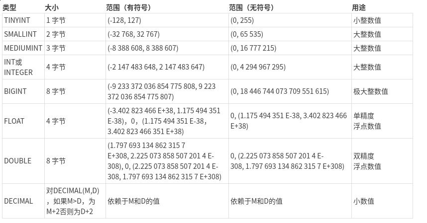
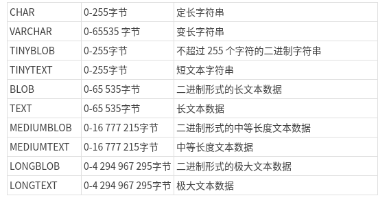
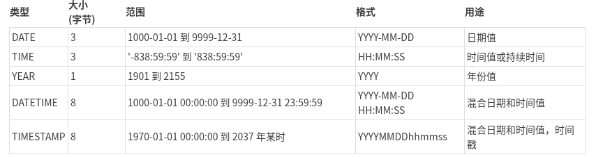

mysql:数据类型选择与优化
======

---

本来准备写一下网络编程方面的东西,可惜本周学习的很辛苦,没有学到可以写成文章的程度.刚好这周再看<高性能MySQL>,结合自己平时在公司工作和学习经验,写这一篇短短的文章,主要谈谈自己平时常用的数据类型

---

MySQL支持的数据类型非常多,如何选择合适的数据类型对应性能而言非常重要,同样写一些复杂语句下使用不同的数据类型对于性能影响很大.我认为选择数据类型要考虑到几个因素,其一是常用语句对于性能的影响,其二是对于对于索引的影响.第一点自然不必说,第二点也很重要,索引对于MySQL优化至关重要,使用索引可以大大加速查询速度(当然也会拉慢更新删除的时间,这就是我常常说的权衡与平衡).

---

### 几个大的原则

- 更小的更好 
    使用更小的数据更小的数据类型会更快,对于CPU,磁盘和内存,io时间的消耗更少.但是要注意不要超出使用范围,对于MySQL而言,增加数据范围是非常麻烦的.需要去更新这个表.
- 简单就好 
    简单的数据类型操作起来需要更少的时间.比如使用浮点型DECIMAL之类的在其他语言和MySQL中比之于int型会更慢.再比如使用自建类型,內建类型(date timestamp)要比使用字符串存储时间更合适.因为绝大多数情况下,专业研究数据库的程序员写的代码要比我们写的处理函数更快.更合适.
- 尽量避免使用NULL 
    这一点是针对索引的,如果一个字段会使用索引,那么使用NULL后MySQL,引擎会更难优化. 
    当然也有例外对于使用innoDB引擎而言,使用单独的位(bit)来处理NULL,所以对于不需要建立索引的稀疏数据(大多数数据都是NULL)可以节约更多的磁盘空间

---

接下来我会聊聊常用的数据类型与选择,诸如enum(我个人建议tinyint来替换), bit 这一类数据结构我不会描述,有兴趣的可以自己查看文档

---

### 数值类型
 

 
- 根据我们上面的规则,选择小而简单的是最基本的原则.比如如果一个数据类型,它保存性别,那么使用tinyint是一个合理的选择,及时按照左派的性别分类比如Facebook也不过只有59个而已.
- 对于整数类型而言,有无符号,具有相同的性能和存储空间,在都是自然数的情况下选择无符号是合理.
- decimal类型存储的是精确小数,因此它支持MySQL服务器下的精确运算.但是对于CPU和绝大多数编程语言而言他们支持浮点型运算,会损失精度,但是浮点型的运算速度会更快.这一点需要权衡.使用decimal会需要额外的空间和运算速度.
- 对于货币类型使bigint通常会是一个更为合理的选择.整形比较浮点型会更快,节约更多空间.但是要注意编程语言而言会发生隐式的类型转换从而发生奇怪的变化(这里我们就不建议使用int类型了,更小但是一旦超出运算范围会产生奇怪的bug)
- 用INT UNSIGNED来存储IPv4地址，用VARBINARY来存储IPv6地址，当然存储之前需要用函数转换
- int类型有时会指定一个长度。但是，这里的长度并非是NT类型存储的最大长度，而是显示的最大长度。并不会影响到使用,只会对MySQL工具显示造成影响

### 字符串
 

 
- varchar是可变长的字符串,他比定长类型要节约空间.原因在于他只保存当然存在的长度,但是一旦发生update操作,varchar会需要长度变化,从而造成性能下降
- 对于字符串长度变化大的,更新少的我们建议使用varchar
- 相反char型适合存储很短的字符串,或者长度相近的字符串.比如使用hash算法生成的字符串(md5值, sha1密码)
- 对于varchar而言使用更小的列会更为有效,更节约运算使用内存.因为对于MySQL引擎而言,他会倾向与使用固定大小的块来保持内部值,比如临时表.对于varchar(255)对比varchar(20),会在内部优化与计算中产生更大的内存.
- BLOB系列存储二进制字符串，与字符集无关。TEXT系列存储非二进制字符串，与字符集相关。一般情况下，你可以认为BLOB是一个更大的VARBINARY；TEXT是一个更大的VARCHAR
- BLOB和TEXT都不能有默认值,也无法建立索引(不是全文索引),只能针对前面一些字符建立索引
- BLOB系列存储二进制字符串，与字符集无关。TEXT系列存储非二进制字符串，与字符集相关。一般情况下，你可以认为BLOB是一个更大的VARBINARY；TEXT是一个更大的VARCHAR
- BINARY 和 VARBINARY 与 CHAR 和 VARCHAR 类似,但是他们保存的是二进制串,与字符集无关

### 日期类型 

 
- 用MySQL的内建类型DATE、TIME、DATETIME来存储时间，而不是使用字符串
- 相比较于datetime类型我们更推荐使用timestamp类型,他的空间效率更高,但要注意timestamp的范围更短
- MySQL只支持秒级别的时间,如果需要微秒级别时间,可以使用BIGINT来保存,或者采用MariaDB代替MySQL
