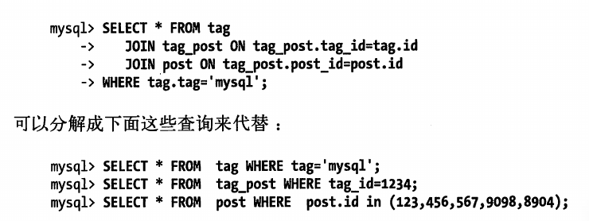

mysql 查询语句优化经验总结1
===
---

本文实际上是<高性能mysql>一书第六章查询性能优化一张的读后感与总计,并结合在网上看到的优秀文章,综合形成的一篇文章,重点在于将查询语句优化中的重要知识要点和经验记录下来.

---

### 序

查询语句的优化,本身并不是孤立的.它与索引优化,表结构设计构成了mysql优化的三个基石,优秀的索引设计与表结构设计本身就是查询语句的基石,三者相辅相成.想要写一个好的查询语句,就要必须理解schema设计与索引设计,反之亦然.

### 总体原则

大多数情况下查询性能底下最主要原因在于访问数据过多,因此对于查询语句优化我们有两大原则
- 避免想数据库请求不需要的数据
- 避免MySQL引擎扫描额外的记录

### 是否向数据库请求了不需要的记录
有些查询会请求超过实际需求的数据,这些多余的数据最后会被抛弃,不但给MySQL服务器带来额外的负担,同时还增加了网络的开销,并消耗应用服务器的资源.
因此我总结了以下几类需要尽量避免的情况
1. 使用select \* 取出所有的列 
取出所有的列,会让优化器无法完成索引覆盖这一类优化,同时带来额外的I/O,内存与CPU消耗.因此在许多DBA禁止使用该语句,同时在网上众多文章中也经常提及这一点. 
但实际上在返回需要的数据,并不总是坏事.比如很多情况下可以提高代码的可复用性,使用缓存机制的应用程序也有好处.但是在使用诸如select \* 时候,请注意我上面提到的代价,谨慎思考这样使用带来的好处时候覆盖了引发的代价
2. 使用limit 
一个常见的错误是误以为MySQL会只返回需要的数据,实际上MySQL却是会想返回全部的结果集在进行计算,因此使用limit会大大优化这一类语句的性能

3.  当只要一行数据时使用 LIMIT 1 
大多数的数据库框架都会提供get方法,在查询一条语句的情况下,会优化使用limit 1. 
当你查询表的有些时候你已经知道结果只会有一条结果但因为你可能需要去fetch游标或是你也许会去检查返回的记录数.在这种情况下加上 LIMIT 1 可以增加性能.这样一样MySQL数据库引擎会在找到一条数据后停止搜索而不是继续往后查少下一条符合记录的数据. 
这也就符合我们上面文章中提到的使用limit标准

### MySQL引擎是否在扫描额外的记录
本部分的内容实际上非常的复杂,需要涉及到大量MySQL引擎底层的内容,本人水平有限,并不能做有效的总结,只能说这部分的内容考验的是个人对于数据库的内功.因此这里我自讨简单的几个内容,想要了解更多东西,可以参考<高性能MySQL>相关章节的内容.
#### explain的使用 
无论如何,使用xplain语句查询性能优化不可缺少的一部分.使用explain我们可以了解到引擎时候在扫描额外的记录,并且做出对应的优化,添加合适的索引.可以缠绕这篇文章来了解[explain](https://www.jianshu.com/p/ea3fc71fdc45)的使用
####

### 查询语句的重构
有时候我们可以把查询转换成一种写法让其返回一样的结果,但是性能更好
#### 复杂查询还是简单查询
MySQL作为一个轻量级数据库他的连接和断开都是很轻量级,现代网络环境下,MySQL服务器也支持更多更快的小查询. 
因此在很多情况下多的小查询替代复杂查询是有利的.首先带来的是代码层面上的逻辑简化,其次是减少复杂查询扫描更多行的数据. 
不过在某些情况下,一条查询能够胜任的情况下还写成多次查询就是不明智的.比如在对一个数据表limit 10查询,之后又对每一行的某一列id查询另一个表,这样就会查询11次,使用join语句会优化就能在一次查询中完成查询.

### 切分查询
有时候对于一个大的查询我们需要分而治之,每一个查询都完全一样,每次只返回一小部分.
比如我们需要删除某个月的消息,一次性delete 对于服务器而言压力很大,我们可以每次只删除10000条,循环处理,大大降低对于服务器的影响,同事降低删除时锁的持有时间

### 分解关联查询
有时候我们使用多条语句分解一条长的关联查询,例如 
 
上面的查询中我们通过缓存数据,从而实现了拆分关联查询.
这样有这些好处
- 让缓存的效率更高,尤其是应用程序比如PHP这一层
- 减少单个查询可以减少锁的竞争
- 在应用层做关联,可以更容易进行拆分,更容易做到高性能扩展
- 查询效率也有可能得到提升,在这里我们通过in 操作代替了关联查询,让MySQL可以按照ID顺序查询(通常而言会在主键上)
- 在应用层查询,可能会减少荣誉记录的查询
