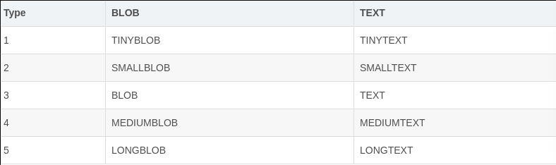

mysql: blob格式和text格式
===
---

这一周主要看了<高性能mysql>一书中数据库配置这一块的文章,本来想写一篇博客作为对应的观后感,不过看到其中章节开篇中嘲讽了不要轻易看博客和论坛中关于数据库配置这一块行为,作者表示这一块最好找专业人士帮助,不然也也可以看书,学习诸如各类配置公式和工具监控.不禁哑然失笑,放弃这一块的写作.选一篇水一点的题材来聊一聊blob格式和text格式.

---
### 序
BLOB与TEXT都是为存储大量字符串类型的数据而设计的,BLOB采用二级制方式存储,TEXT采用字符方式存储.
 

 
BLOB有4种类型:TINYBLOB.BLOB.MEDIUMBLOB和LONGBLOB.它们只是可容纳值的最大长度不同.

TEXT也有4种类型:TINYTEXT,TEXT.MEDIUMTEXT和LONGTEXT.这些类型同BLOB类型一样,有相同的最大长度和存储需求.

### 某些细节

- 当保存或检索BLOB和TEXT列的值时不删除尾部空格.

- 对于BLOB和TEXT列的索引,必须指定索引前缀的长度.
- BLOB和TEXT列不能有默认值.
- 当排序时只使用该列的前max_sort_length个字节.max_sort_length的 默认值是1024.

- 当你想要使超过max_sort_length的字节有意义,对含长值的BLOB或TEXT列使用GROUP BY或ORDER BY的另一种方式是将列值转换为固定长度的对象.标准方法是使用SUBSTRING函数.
- BLOB或TEXT对象的最大大小由其类型确定,但在客户端和服务器之间实际可以传递的最大值由可用内存数量和通信缓存区大小确定.你可以通过更改max_allowed_packet变量的值更改消息缓存区的大小,但必须同时修改服务器和客户端程序.
- 有时候可以使用COMPRESS()压缩后在保存BLOB.或者在发送到MySQL之前在应用程序这一层进行压缩

### 问题
使用blob类型和text类型有很多问题.因此我个人建议不到万不得已都不要使用blob类型.(比如使用varchar保存路径而不是直接保存图片)
- 对于BLOB和TEXT列的索引,必须指定索引前缀的长度.因此通常我不建议在上面建立索引
- 服务器不能在内存临时表存储blob类型,一旦使用临时表,有涉及到blob类型,就会在磁盘上创建临时比表,这样效率很低
- 对于PHP对于较大且修改少的字段,我建议直接使用文件缓存数据而不是保存在数据库中.
