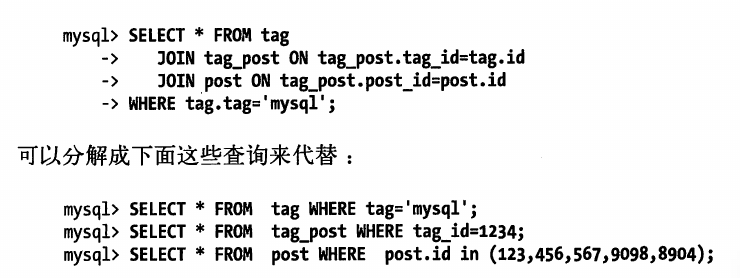
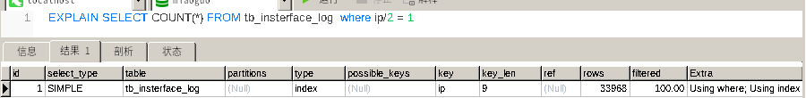
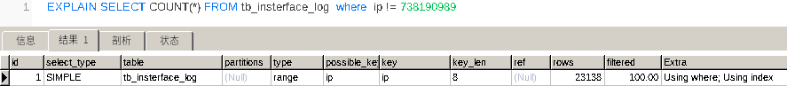
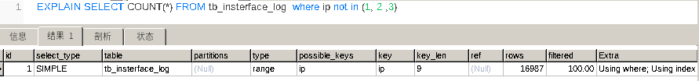
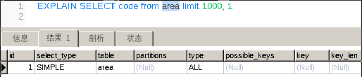
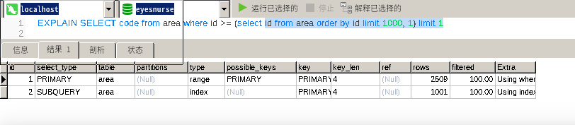
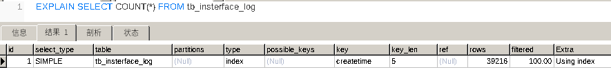
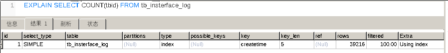
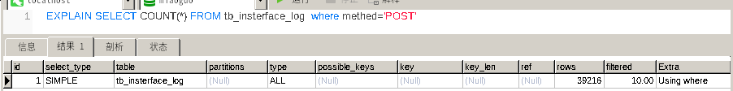

mysql 语句优化的十个经验
===

---

本文算是前一篇 [查询语句优化经验](../2018-6/optimize-query-for-mysql,md)总结1的后续,总结了<高性能mysql>中与网上常见的一些优化经验中出现的案例进行总结与勘误.但是要注意本文中出现的explain结论都是出现在mysql 5.7.18中,要注意mysql在5.6中出现了大量的升级,以往许多经验都开始失效,需要注意

---

### 分解关联查询
分解关联查询是一种极为行之有效的办法优化查询语句.我们使用多条语句分解一条长的关联查询,例如 
 
上面的查询中我们通过在应用程序这一层(PHP,Java中)缓存数据,从而实现了拆分关联查询.
这样有这些好处
- 让缓存的效率更高,尤其是应用程序比如PHP这一层
- 减少单个查询可以减少锁的竞争
- 在应用层做关联,可以更容易进行拆分,更容易做到高性能扩展
- 查询效率也有可能得到提升,在这里我们通过in 操作代替了关联查询,让MySQL可以按照ID顺序查询(通常而言会在主键上)
- 在应用层查询,可能会减少荣誉记录的查询

### 审慎的使用索引

对于查询优化而言,索引永远是最有效也是最直接的利器.但是作为一把双刃剑,请永远谨慎使用它.如果你和我一样是非dba但是需要自己建立库表,请尽量在了解索引的基础上建立索引.毕竟索引时有代价,我的上一篇关于索引的文章就是好一篇不错(我自认为不错的科普). 
在某些情况下,如果你发现后某些查询语句很慢(比如开启了慢查询日志),可是使用explain来优化查询,添加使用索引. 

### 关于索引的语句优化常见原则勘误

在网上我们经常看到许多作者写了许多关于语句优化的经验.我个人认为这一类优化经验往往都是很早引擎版本的经验,写作者自己没有写出版本,甚至只是看到别人这么写自己只是抄下来.因此我认为这一类索引优化的语句,在不引擎版本下都会有不同表现,每一次都应该切身实地使用explain判断一下. 
现在我对于这一类优化语句进行勘误,当前MySQL 版本mysql 5.7.18 
下面的观点都是正确的观点请尽量遵循
- 对查询进行优化，应尽量避免全表扫描，首先应考虑在 where 及 order by 涉及的列上建立索引
- 尽量避免默认NULL值的出现，否则将导致引擎放弃使用索引而进行全表扫描
这个观点实际上很复杂,我个人尝试is null,在explain中并不会影响索引使用. 
但是网上关于他的讨论很多,在<高性能mysql>中也建议尽量不要使用默认NULL,改用其他的默认值(比如 0,空字符串).关于这一块的讨论我给两个连接,感兴趣的朋友可以继续阅读.[链接1](http://www.techug.com/post/you-should-not-use-null-in-mysql.html)  [链接2](https://www.v2ex.com/t/60437)
我个人的建议是遵循这个原则

- 在使用索引时,避免非做匹配情况出现.这一点我在索引的那篇文章中就已经提到.对于字符串的单索引,避免这一类语句的出现 
select id from t where name like ‘%c%’
 
对于复合索引,要避免在右边的部分先出现.

- 应尽量避免在 where 子句中对字段进行表达式操作，这将导致引擎放弃使用索引而进行全表扫描

错误,在5.7下会使用索引
 

 
但是处于代码优化的建议我尽量优化表达式,将表达式简化
- 应尽量避免在 where 子句中使用!=或<>操作符，否否则将引擎放弃使用索引而进行全表扫描 
错误,在5.7下会使用索引
 

 
-
- in 和 not in 也要慎用，否则会导致全表扫描

错误,在5.7下会使用索引

 

 

总结一下,对于索引的使用要慎重,在不同版本下的索引由于优化的区别,往往之前的经验可能就不在奏效,这里再一次建议使用explain语句分析查询语句的索引使用情况.在这里推荐一篇关于explain的[文章](https://www.jianshu.com/p/ea3fc71fdc45)
### 在只需要一条记录的情况下使用limit 1

我们在前文中提到了使用limit的种种好处,但是要注意这些好处是对于limit没有偏移量的情况,也就是只返回特定的行数的情况下.在添加了偏移量之后引擎依旧会去遍历直到到达偏移量的位置.我会在下文中提到如有优化这一类语句. 
通常在框架中会提供get方法来获取一行,我们直接使用它就好.

### 对于大偏移量limit如何处理

事实上如果有如果有超大表,大数据下本身就是需要进行分表分库来处理数据了.不过有的时候我们可能暂时还是只能用一个表来处理,那么这时候该怎么办? 
在<高性能mysql>一书中给出一个很好的解决方法,那就是通过子查询把对应偏移量转换成主键上的条件. 
在这里我们通过一个explain 来测试一下首先我们给出一个没有使用子查询的语句 

 
我们在前一篇文章中提到了如果不进行优化limit 偏移量会进行全表扫描
这时候我们使用在主键上的子查询来进行替换
 

 
在这里我们看到使用子查询的优化,重点在于子查询的效率.通过合理使用使用索引技术可以加快这一条子查询的效率

### 避免使用select \*

取出所有的列,会让优化器无法完成索引覆盖这一类优化,同时带来额外的I/O,内存与CPU消耗.因此在许多DBA禁止使用该语句,同时在网上众多文章中也经常提及这一点. 
但实际上在返回需要的数据,并不总是坏事.比如很多情况下可以提高代码的可复用性,使用缓存机制的应用程序也有好处.但是在使用诸如select \* 时候,请注意我上面提到的代价,谨慎思考这样使用带来的好处时候覆盖了引发的代价

### 尽量使用count *

对于myisam引擎下,无条件的count \* 速度非常快,这是因为数据表会直接保存当前的条数,所以可以直接访问,当然添加了条件后 count \* 的速度会很慢
在当前的innodb引擎下,无条件的count \* 等价于 count(主键).
 

 
 

 
而一旦使用条件查询,请尽量使用在where语句中使用索引条件,以避免退化全表扫描
 

 

### 拆分大的 DELETE 或 INSERT 语句

有时候对于一个大的查询我们需要分而治之,每一个查询都完全一样,每次只返回一小部分. 
比如我们需要删除某个月的消息,一次性delete 对于服务器而言压力很大,我们可以每次只删除10000条,循环处理,大大降低对于服务器的影响,同事降低删除时锁的持有时间. 
另外MySQL虽然没有提供批量插入的函数,但是允许insert同时插入多行,他的效率要远远大于很多次insert.应该尽量避免大量insert到引擎中.

### 谨慎使用临时表

一方面临时表本身需要资源进行维护,另一方面临时表本身是不具有索引的,即便你的原来的查询表有索引,因此使用临时表会大大拉慢查询.因此使用临时表时候,考虑是否有其他写法进行替换.

### 谨慎使用order by 进行排序

我之前在索引的文章中提到,对查询进行排序是一个成本是非高的操作.下面给出一组建议,从上到下,建议度依次下降
- 从性能上考虑,应该尽量避免排序,或者尽可能避免对大量数据进行排序.
- 如果不行也请尽量在主键上进行排序,因为主键会使用簇集索引
- 没有主键上排序,也请尽量在索引上排序,如果有多条排序,可以考虑组合索引,但是要注意索引的左匹配原则  
- 如果没有索引,引擎,会自己排序,我们称之为文件排序(如果数据小,会在内存中进行,但是大多数情况下依旧会使用磁盘).这涉及到很底层的内容本文不会进行详细描述,感兴趣的朋友可以执行阅读<数据库实现>.总之,即便引擎进行大量优化,文件排序生成的临时存储空间和资源也要比你想象中的大,因此尽量避免这种情况
