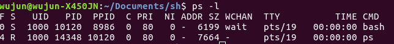
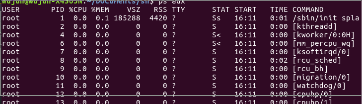
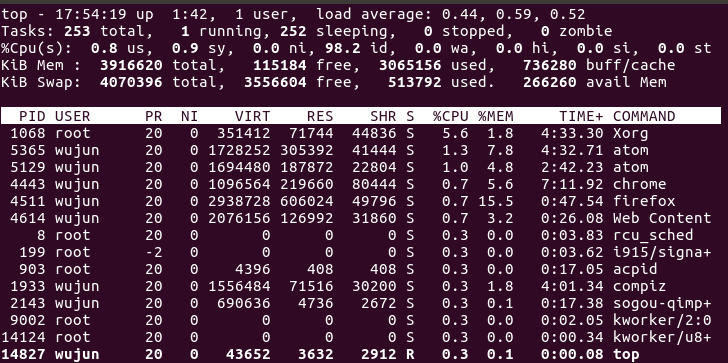
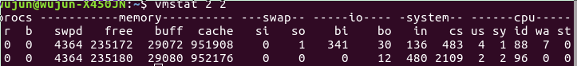
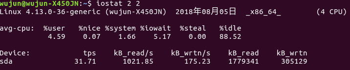
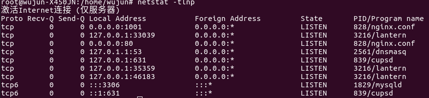

linux: 系统状态工具
===
---

作为常年在win下面操作的普通程序员,window下面几乎万能的任务管理器实在是居家旅行出门必备的神器.但是一旦涉及Linux下,原本和Windows操作系统斗智斗勇的经验就沦为灰烟.本文将总结那些常用的系统状态工具,以作为整理(其实是本人看了<高性能MySQL>中关于系统参数一章后实在没什么可以总结的东西,写了这一篇)

---

### PS
ps:report a snapshot of the current processes.翻译成中文就是返回当前进程的快照.使用该命令可以确定有哪些进程正在运行和运行的状态,进程是否结束,进程有没有僵尸.哪些进程占用了过多的资源等等.总之大部分信息都是可以通过执行该命令得到。ps是显示瞬间进程的状态，并不动态连续;如果想对进程进行实时监控应该用top命令.
参数:

-A : 所有的进程均显示出来,与 -e 具有同样的效用；
-a : 显示现行终端机下的所有进程，包括其他用户的进程；
-u : 以用户为主的进程状态;
x ：通常与 a 这个参数一起使用，可列出较完整信息。
输出格式规划：

l ：较长、较详细的将该PID 的的信息列出；
j ：工作的格式 (jobs format)
-f ：做一个更为完整的输出。

<鸟哥的Linux私房菜>(天不生鸟哥,不知道有多少Linux小白要被国内那些垃圾书和垃圾翻译给污染.顺便一提鸟哥不是程序员,我认识的朋友里面也有那种搞摄影设备但是Linux玩的非常溜的朋友)一书中重点说了只需要记住两组命令.1是只查询自己bash程序的"ps -l". 一种是查看所有进程的"ps aux"
 

 
F 代表这个程序的旗标 (flag)， 4 代表使用者为 superuser；

S 代表这个程序的状态 (STAT)；

UID 代表执行者身份;

PID 进程的ID号;

PPID 父进程的ID；

C CPU使用的资源百分比

PRI指进程的执行优先权(Priority的简写)，其值越小越早被执行；

NI 这个进程的nice值，其表示进程可被执行的优先级的修正数值。

ADDR 这个是内核函数，指出该程序在内存的那个部分。如果是个执行 的程序，一般就是『 - 』

SZ 使用掉的内存大小；

WCHAN 目前这个程序是否正在运作当中，若为 - 表示正在运作；

TTY 登入者的终端机位置；

TIME 使用掉的 CPU 时间。

CMD 所下达的指令名称

 

 
USER：该进程属于那个使用者账号。

PID ：该进程的进程ID号。

%CPU：该进程使用掉的 CPU 资源百分比；

%MEM：该进程所占用的物理内存百分比；

VSZ ：该进程使用掉的虚拟内存量 (Kbytes)

RSS ：该进程占用的固定的内存量 (Kbytes)

TTY ：该进程是在那个终端机上面运作，若与终端机无关，则显示 ?。另外， tty1-tty6 是本机上面的登入者程序，若为 pts/0 等等的，则表示为由网络连接进主机的程序。

STAT：该程序目前的状态

主要的状态有：
- R ：该程序目前正在运作，或者是可被运作；
- S ：该程序目前正在睡眠当中，但可被某些讯号(signal) 唤醒。
- T ：该程序目前正在侦测或者是停止了；
- Z ：该程序应该已经终止，但是其父程序却无法正常的终止他，造成 zombie (疆尸) 程序的状态

START：该进程被触发启动的时间；

TIME ：该进程实际使用 CPU 运作的时间。

 COMMAND：该程序的实际指令

 ### top
 top命令能够实时显示系统中各个进程的资源占用状况，常用于服务端性能分析.
  
 
  
 top命令的结果分为两个部分：

统计信息：前五行是系统整体的统计信息；
进程信息：统计信息下方类似表格区域显示的是各个进程的详细信息，默认5秒刷新一次。

统计信息说明：

- 第1行：Top 任务队列信息(系统运行状态及平均负载)，与uptime命令结果相同。
第1段：系统当前时间，例如：16:07:37
第2段：系统运行时间，未重启的时间，时间越长系统越稳定。
格式：up xx days, HH:MM
例如：241 days, 20:11, 表示连续运行了241天20小时11分钟
第3段：当前登录用户数，例如：1 user，表示当前只有1个用户登录
第4段：系统负载，即任务队列的平均长度，3个数值分别统计最近1，5，15分钟的系统平均负载
系统平均负载：单核CPU情况下，0.00 表示没有任何负荷，1.00表示刚好满负荷，超过1侧表示超负荷，理想值是0.7；
多核CPU负载：CPU核数 * 理想值0.7 = 理想负荷，例如：4核CPU负载不超过2.8何表示没有出现高负载。
- 第2行：Tasks 进程相关信息
第1段：进程总数，例如：Tasks: 231 total, 表示总共运行231个进程
第2段：正在运行的进程数，例如：1 running,
第3段：睡眠的进程数，例如：230 sleeping,
第4段：停止的进程数，例如：0 stopped,
第5段：僵尸进程数，例如：0 zombie
- 第3行：Cpus CPU相关信息，如果是多核CPU，按数字1可显示各核CPU信息，此时1行将转为Cpu核数行，数字1可以来回切换。
第1段：us 用户空间占用CPU百分比，例如：Cpu(s): 12.7%us,
第2段：sy 内核空间占用CPU百分比，例如：8.4%sy,
第3段：ni 用户进程空间内改变过优先级的进程占用CPU百分比，例如：0.0%ni,
第4段：id 空闲CPU百分比，例如：77.1%id,
第5段：wa 等待输入输出的CPU时间百分比，例如：0.0%wa,
第6段：hi CPU服务于硬件中断所耗费的时间总额，例如：0.0%hi,
第7段：si CPU服务软中断所耗费的时间总额，例如：1.8%si,
第8段：st Steal time 虚拟机被hypervisor偷去的CPU时间（如果当前处于一个hypervisor下的vm，实际上hypervisor也是要消耗一部分CPU处理时间的）
- 第4行：Mem 内存相关信息（Mem: 12196436k total, 12056552k used, 139884k free, 64564k buffers）
第1段：物理内存总量，例如：Mem: 12196436k total,
第2段：使用的物理内存总量，例如：12056552k used,
第3段：空闲内存总量，例如：Mem: 139884k free,
第4段：用作内核缓存的内存量，例如：64564k buffers
- 第5行：Swap 交换分区相关信息（Swap: 2097144k total, 151016k used, 1946128k free, 3120236k cached）
第1段：交换区总量，例如：Swap: 2097144k total,
第2段：使用的交换区总量，例如：151016k used,
第3段：空闲交换区总量，例如：1946128k free,
第4段：缓冲的交换区总量，3120236k cached

进程信息：

在top命令中按f按可以查看显示的列信息，按对应字母来开启/关闭列，大写字母表示开启，小写字母表示关闭。带*号的是默认列。

- A: PID = (Process Id) 进程Id；
- E: USER = (User Name) 进程所有者的用户名；
- H: PR = (Priority) 优先级
- I: NI = (Nice value) nice值。负值表示高优先级，正值表示低优先级
- O: VIRT = (Virtual Image (kb)) 进程使用的虚拟内存总量，单位kb。VIRT=SWAP+RES
- Q: RES = (Resident size (kb)) 进程使用的、未被换出的物理内存大小，单位kb。RES=CODE+DATA
- T: SHR = (Shared Mem size (kb)) 共享内存大小，单位kb
- W: S = (Process Status) 进程状态。D=不可中断的睡眠状态,R=运行,S=睡眠,T=跟踪/停止,Z=僵尸进程
- K: %CPU = (CPU usage) 上次更新到现在的CPU时间占用百分比
- N: %MEM = (Memory usage (RES)) 进程使用的物理内存百分比
- M: TIME+ = (CPU Time, hundredths) 进程使用的CPU时间总计，单位1/100秒
- b: PPID = (Parent Process Pid) 父进程Id
- c: RUSER = (Real user name)
- d: UID = (User Id) 进程所有者的用户id
- f: GROUP = (Group Name) 进程所有者的组名
- g: TTY = (Controlling Tty) 启动进程的终端名。不是从终端启动的进程则显示为 ?
- j: P = (Last used cpu (SMP)) 最后使用的CPU，仅在多CPU环境下有意义
- p: SWAP = (Swapped size (kb)) 进程使用的虚拟内存中，被换出的大小，单位kb
- l: TIME = (CPU Time) 进程使用的CPU时间总计，单位秒
- r: CODE = (Code size (kb)) 可执行代码占用的物理内存大小，单位kb
- s: DATA = (Data+Stack size (kb)) 可执行代码以外的部分(数据段+栈)占用的物理内存大小，单位kb
- u: nFLT = (Page Fault count) 页面错误次数
- v: nDRT = (Dirty Pages count) 最后一次写入到现在，被修改过的页面数
- y: WCHAN = (Sleeping in Function) 若该进程在睡眠，则显示睡眠中的系统函数名
- z: Flags = (Task Flags <sched.h>) 任务标志，参考 sched.h
- X: COMMAND = (Command name/line) 命令名/命令行

top命令选项

- -b：以批处理模式操作；
- -c：显示完整的治命令；
- -d：屏幕刷新间隔时间；
- -I：忽略失效过程；
- -s：保密模式；
- -S：累积模式；
- -i<时间>：设置间隔时间；
- -u<用户名>：指定用户名；
- -p<进程号>：指定进程；
- -n<次数>：循环显示的次数。

### vmstat

vmstat命令可以展现给定时间间隔的服务器的状态值,包括服务器的CPU使用率，内存使用，虚拟内存交换情况,IO读写情况。
 命令格式
iostat[参数][时间][次数]
参数
- -a：显示活动内页；
- -f：显示启动后创建的进程总数；
- -m：显示slab信息；
- -n：头信息仅显示一次；
- -s：以表格方式显示事件计数器和内存状态；
- -d：报告磁盘状态；
- -p：显示指定的硬盘分区状态；
- -S：输出信息的单位。

vmstat工具的使用是通过两个数字参数来完成的，第一个参数是采样的时间间隔数，单位是秒，第二个参数是采样的次数，如:
 

 
现在分析一个各个参数的意思
r 表示运行队列(就是说多少个进程真的分配到CPU)，我测试的服务器目前CPU比较空闲，没什么程序在跑，当这个值超过了CPU数目，就会出现CPU瓶颈了。这个也和top的负载有关系，一般负载超过了3就比较高，超过了5就高，超过了10就不正常了，服务器的状态很危险。top的负载类似每秒的运行队列。如果运行队列过大，表示你的CPU很繁忙，一般会造成CPU使用率很高。

b 表示阻塞的进程,这个不多说，进程阻塞，大家懂的。

swpd 虚拟内存已使用的大小，如果大于0，表示你的机器物理内存不足了，如果不是程序内存泄露的原因，那么你该升级内存了或者把耗内存的任务迁移到其他机器。

free   空闲的物理内存的大小，我的机器内存总共8G，剩余3415M。

buff   Linux/Unix系统是用来存储，目录里面有什么内容，权限等的缓存，我本机大概占用300多M

cache cache直接用来记忆我们打开的文件,给文件做缓冲，我本机大概占用300多M(这里是Linux/Unix的聪明之处，把空闲的物理内存的一部分拿来做文件和目录的缓存，是为了提高 程序执行的性能，当程序使用内存时，buffer/cached会很快地被使用。)

si  每秒从磁盘读入虚拟内存的大小，如果这个值大于0，表示物理内存不够用或者内存泄露了，要查找耗内存进程解决掉。我的机器内存充裕，一切正常。

so  每秒虚拟内存写入磁盘的大小，如果这个值大于0，同上。

bi  块设备每秒接收的块数量，这里的块设备是指系统上所有的磁盘和其他块设备，默认块大小是1024byte，我本机上没什么IO操作，所以一直是0，但是我曾在处理拷贝大量数据(2-3T)的机器上看过可以达到140000/s，磁盘写入速度差不多140M每秒

bo 块设备每秒发送的块数量，例如我们读取文件，bo就要大于0。bi和bo一般都要接近0，不然就是IO过于频繁，需要调整。

in 每秒CPU的中断次数，包括时间中断

cs 每秒上下文切换次数，例如我们调用系统函数，就要进行上下文切换，线程的切换，也要进程上下文切换，这个值要越小越好，太大了，要考虑调低线程或者进程的数目,例如在apache和nginx这种web服务器中，我们一般做性能测试时会进行几千并发甚至几万并发的测试，选择web服务器的进程可以由进程或者线程的峰值一直下调，压测，直到cs到一个比较小的值，这个进程和线程数就是比较合适的值了。系统调用也是，每次调用系统函数，我们的代码就会进入内核空间，导致上下文切换，这个是很耗资源，也要尽量避免频繁调用系统函数。上下文切换次数过多表示你的CPU大部分浪费在上下文切换，导致CPU干正经事的时间少了，CPU没有充分利用，是不可取的。

us 用户CPU时间，我曾经在一个做加密解密很频繁的服务器上，可以看到us接近100,r运行队列达到80(机器在做压力测试，性能表现不佳)。

sy 系统CPU时间，如果太高，表示系统调用时间长，例如是IO操作频繁。

id  空闲 CPU时间，一般来说，id + us + sy = 100,一般我认为id是空闲CPU使用率，us是用户CPU使用率，sy是系统CPU使用率。

wt 等待IO CPU时间。

### iostat

有内存自然有磁盘了.iostat是I/O statistics（输入/输出统计）的缩写，iostat工具将对系统的磁盘操作活动进行监视.

命令格式
iostat[参数][时间][次数]

- -C 显示CPU使用情况
- -d 显示磁盘使用情况
- -k 以 KB 为单位显示
- -m 以 M 为单位显示
- -N 显示磁盘阵列(LVM) 信息
- -n 显示NFS 使用情况
- -p[磁盘] 显示磁盘和分区的情况
- -t 显示终端和CPU的信息
- -x 显示详细信息
- -V 显示版本信息

 

 

CPU 属性值

- %user：CPU处在用户模式下的时间百分比。
- %nice：CPU处在带NICE值的用户模式下的时间百分比。
- %system：CPU处在系统模式下的时间百分比。
- %iowait：CPU等待输入输出完成时间的百分比。
- %steal：管理程序维护另一个虚拟处理器时，虚拟CPU的无意识等待时间百分比。
%idle：CPU空闲时间百分比。

备注：

- 如果%iowait的值过高，表示硬盘存在I/O瓶颈，
- %idle值高，表示CPU较空闲，
如果%idle值高但系统响应慢时，有可能是CPU等待分配内存，此时应加大内存容量。
- %idle值如果持续低于10，那么系统的CPU处理能力相对较低，表明系统中最需要解决的资源是CPU。

磁盘每一列的含义如下:

- rrqm/s:     每秒进行 merge 的读操作数目。 即 rmerge/s
- wrqm/s:     每秒进行 merge 的写操作数目。即 wmerge/s
- r/s:        每秒完成的读 I/O 设备次数。 即 rio/s
- w/s:        每秒完成的写 I/O 设备次数。即 wio/s
- rsec/s:        每秒读扇区数。即 rsect/s
- wsec/s:        每秒写扇区数。即 wsect/s
- rkB/s:        每秒读 K 字节数。是 rsect/s 的一半,因为扇区大小为 512 字节
- wkB/s:         每秒写 K 字节数。是 wsect/s 的一半
- avgrq-sz:    平均每次设备 I/O 操作的数据大小(扇区)
- avgqu-sz:    平均 I/O 队列长度。
- await:        平均每次设备 I/O 操作的等待时间(毫秒)
- svctm:        平均每次设备 I/O 操作的服务时间(毫秒)
- %util:        一秒中有百分之多少的时间用于 I/O 操作,或者说一秒中有多少时间 I/O 队列是非空的。

备注：

- 如果 %util 接近 100%，说明产生的I/O请求太多，I/O系统已经满负荷，该磁盘可能存在瓶颈。
- 如果 svctm 比较接近 await，说明 I/O 几乎没有等待时间；
- 如果 await 远大于 svctm，说明I/O 队列太长，io响应太慢，则需要进行必要优化。
- 如果avgqu-sz比较大，也表示有当量io在等待。

### netstat

netstat 命令用于显示各种网络相关信息，如网络连接，路由表，接口状态 (Interface Statistics)，masquerade 连接，多播成员 (Multicast Memberships) 等等

- -a或--all：显示所有连线中的Socket；
- -A<网络类型>或--<网络类型>：列出该网络类型连线中的相关地址；
- -c或--continuous：持续列出网络状态；
- -C或--cache：显示路由器配置的快取信息；
- -e或--extend：显示网络其他相关信息；
- -F或--fib：显示FIB；
- -g或--groups：显示多重广播功能群组组员名单；
- -h或--help：在线帮助；
- -i或--interfaces：显示网络界面信息表单；
- -l或--listening：显示监控中的服务器的Socket；
- -M或--masquerade：显示伪装的网络连线；
- -n或--numeric：直接使用ip地址，而不通过域名服务器；
- -N或--netlink或--symbolic：显示网络硬件外围设备的符号连接名称；
- -o或--timers：显示计时器；
- -p或--programs：显示正在使用Socket的程序识别码和程序名称；
- -r或--route：显示Routing Table；
- -s或--statistice：显示网络工作信息统计表；
- -t或--tcp：显示TCP传输协议的连线状况；
- -u或--udp：显示UDP传输协议的连线状况；
- -v或--verbose：显示指令执行过程；
- -V或--version：显示版本信息；
- -w或--raw：显示RAW传输协议的连线状况；
- -x或--unix：此参数的效果和指定"-A unix"参数相同；
- --ip或--inet：此参数的效果和指定"-A inet"参数相同。

这里我们举例,找出系统正在监听的网络连接和pid.这里我们必须使用root用户,否则无法查看其他用户的进程pid

 

 

### 其他命令

其他这些命令我就不一一细数,感兴趣的可以自己开动搜索引擎查看.

- free 查看内存使用情况
- uname 查看系统与内核相关信息
- dmesg 分析内核产生的信息
