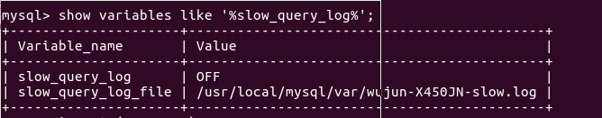
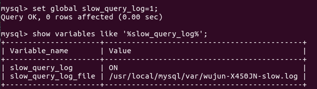
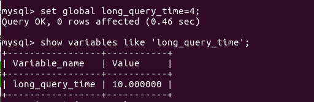
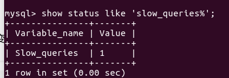
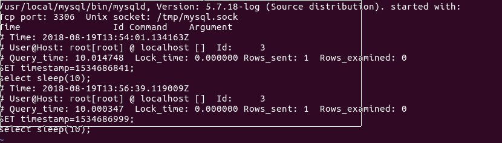

mysql:慢查询日志
===
---

对于MySQL性能调优,通常而言有两种情况.其一是单条查询语句有问题,导致大幅拖慢查询速度,契尔氏服务器出现问题,诸如内存耗尽网络异常磁盘耗尽等情况.这时候我们就需要去定位.在<高性能mysql>一书中作者给出两种技术来定位问题:

1 通过高频率调用SHOW GLOBAL STATUS/SHOW PROCESSLIST这两类命令通过参数来观察数据发生了上面.

2 来查看慢查询日志数据库吞吐量发生的变化

在这里本文将对慢查询日志的使用进行一次实践,用来学习慢查询日志的使用
---
===

### 慢查询日志的开启和关闭

默认情况下slow_query_log的值为OFF,表示慢查询日志是禁用的,可以通过设置slow_query_log的值来开启,如下所示:

使用set global slow_query_log=1开启了慢查询日志只对当前数据库生效,MySQL重启后则会失效.只有通过修改配置文件(通常是my.cnf),才能共永久储存.通常情况下的调试我推荐使用命令行来修改,这样对于查询更为简单,在查看问题之后也更容易容易关闭而不需要重启服务器.

 由参数long_query_time,如果查询比这个参数慢.则会被记录在日志中.默认情况下long_query_time的值为10秒,可以使用命令修改,也可以在my.cnf参数里面修改.从MySQL 5.1开始,long_query_time开始以微秒记录SQL语句运行时间,之前仅用秒为单位记录.如果记录到表里面,只会记录整数部分,不会记录微秒部分.

 同样的这个参数可以通过查询修改,也可以通过配置文件修改.而查询修改在重启后会失效.

 

 log_output 参数是指定日志的存储方式。log_output='FILE'表示将日志存入文件，默认值是'FILE'。log_output='TABLE'表示将日志存入数据库，这样日志信息就会被写入到mysql.slow_log表中。MySQL数据库支持同时两种日志存储方式，配置的时候以逗号隔开即可，如：log_output='FILE,TABLE'。日志记录到系统的专用日志表中，要比记录到文件耗费更多的系统资源，因此对于需要启用慢查询日志，又需要能够获得更高的系统性能，那么建议优先记录到文件.

 系统变量log-queries-not-using-indexes：未使用索引的查询也被记录到慢查询日志中（可选项）。如果调优的话，建议开启这个选项。另外，开启了这个参数，其实使用full index scan的sql也会被记录到慢查询日志。

 如果你想查询有多少条慢查询记录，可以使用系统状态slow_queries

现在我们来查看慢查询日志

这个日志比较简单,英语好的人完全可以看懂,我个人认为不需要解释上面.
另外MySQL准备了分析工具mysqldumpslow;可以查阅[文章](https://www.cnblogs.com/moss_tan_jun/p/8025504.html)

通过慢查询日志我们就可以找到对已经的那些语句是慢的语句了,我们可以想办法优化这些语句,或者干脆通过去掉这些查询.
