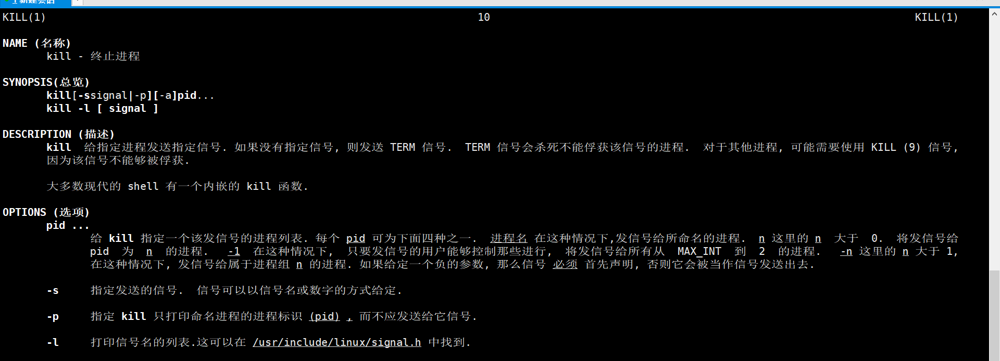

linux 信号
===
---

最近在学nginx(其实是上一本<高性能mysql>,在看补一些C的知识,在困难的知识学习之前,补充一点简单的知识),安在nginx的官网来学习,按照官方文档,最先开始学习如何重启nginx配置,于是学习了kill 命令.刚好趁着这个机会学习一下linux的signal

---
===

### 定义
我们先来看看维基的定义:

Signals are a limited form of inter-process communication (IPC), typically used in Unix, Unix-like, and other POSIX-compliant operating systems. A signal is an asynchronous notification sent to a process or to a specific thread within the same process in order to notify it of an event that occurred.

翻译成中文大体的意思是signals是一种有限的进程通信机制,通常在unix系系统里面使用.信号是发送到进程或同一进程内的特定线程的异步通知,以便通知它发生的事件.

### 使用
linux 的信号通常在一下几种情况
- 首先是在命令行模式下使用的kill命令,这个也是我们通常能够见到
- kill 系统调用,他能发送制定信号到制定进程
- raise 库函数,他能发送制定信号到当前的进程中
- 特定的快捷键也会产生信号,例如ctrl C
Ctrl z
- 某些exception,比如除零也会产生信号
- 父进程死亡后或者控制终端检测到挂起(hangup)也会向发送SIGHUP信号

### 信号的原理
信号是一种异步的的进程通信机制.本人对于linux的内核了解有限,也就只能到这一步.要想有更深入的了解.下面这两篇博客写的不错.[一篇](http://kernel.meizu.com/linux-signal.html)侧重于文字描述基础原理,[一篇](http://www.linuxprogrammingblog.com/all-about-linux-signals?page=show)从代码层面展开分析.

### 信号的种类
关于信号的种类,本文不想做文抄公,感兴趣的可以直接看[维基百科](https://en.wikipedia.org/wiki/Signal_(IPC)#frb-inline), 或者在linux的shell下面使用 man 7 signal命令,就可以看到完整的描述.我觉的这两块都写的非常完善,某些博客大多数都是老老实实抄了这两个地方.

### kill 命令
回到最开始我说的nignx里面的使用kill命令上,这也是大多数不去编写linux C代码的朋友唯一接触到signal的地方.
我们来看看man对于kill命令的描述,

看描述我们知道了kill命令和kill函数关系密切,我们可以继续通过man 2 kill , man 3 kill,查看这些文档.

应注意,信号使进程强行终止,这常会带来一些副作用,如数据丢失或者终端无法恢复到正常状态.发送信号时必须小心,只有在万不得已时,才用kill信号(9),因为进程不能首先捕获它.要撤销所有的后台作业,可以输入kill 0.因为有些在后台运行的命令会启动多个进程,跟踪并找到所有要杀掉的进程的PID是件很麻烦的事.这时,使用kill 0来终止所有由当前shell启动的进程,是个有效的方法.
