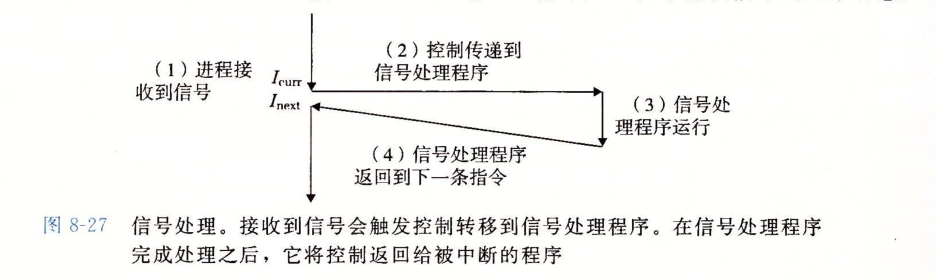

kill命令与进程间的信号机制的讨论
===

本文实际上算是<深入理解计算机系统>第八章异常控制流中关于进程信号机制的一次小小的总结和书摘.只是刚好那kill命令作为切入口而已.平时算是经常敲kill命令,主要有两个,一个是隔三差五强制关闭进程,一个是给nginx重启.刚好看书看到关于kill函数与内部信号的实际机制,本文算是一个回顾.

===

### kill命令

关于kill命令,我们先来看看man怎么说的:

kill  给指定进程发送指定信号.  如果没有指定信号,  则发送  TERM  信号.  TERM 信号会杀死不能俘获该信号的进程.  对于其他进程, 可能需要使用 KILL (9)  信号,因为该信号不能够被俘获.

其实按照他的描述,把kill命令,称呼为send signal会更为合适,实际上是用于在给某个进程传送信号(signal).

### 进程与信号机制

进程是一个执行中的程序的实例(换而言之一个程序可以有多个进程).一个进程具有一个独立的逻辑控制流.在这组控制流进行中我们需要一组机制来实现控制流的转移,进程与系统之间,进程在系统层面我们提供了异常(exception)来进行.而在更高层次的软件层次上则提供了信号机制(signal).

信号本身是一组消息,他是系统用来通知进程发生了某一类事件.这些事件可以使是系统发生异常(例如除零)或者是来自硬件的终端(CTRL+C),也可以来自其他进程(因此信号也提供了一种进程间的通信机制).常见的信号如下图.感兴趣的朋友可以直接敲命令 man 7 signal

比如我们经常使用kill -s 9 pid ,这里的9就是强制终止信号.SIGKILL.

### 信号处理机制

通常情况下发送信号有两种原因.
- 内核检测到一个系统事件.
- 使用kill函数,在命令上可以通过kill命令来调用kill函数.

一个进程可以给自己发送信号.

当目的进程接受到内核发送过来的信号后,他可以选择忽略信号,停止自己,或者通过信号处理函数来处理信号.如果使用信号处理函数来处理,我们如下图

### 信号的柱塞

信号提供了柱塞的机制.包含隐式柱塞和显式柱塞.内核默认柱塞当前任何程序正在执行的进程处理函数的信号.也就是说某个信号正在被处理,此时一个新的相同类型信号到来后他被内核柱塞了,之后新的同类型信号会被忽略.显式柱塞不在本文的讨论过程中,他在编程中使用函数柱塞和关闭柱塞.要注意sigkill信号无法被柱塞和忽略.

### kill命令的参数pid
很多文章提kill命令,都不会提到这个pid的不同,只会说pid是进程id.实际上如果你看kill函数的参数就可以看出端倪.
int kill(pid_t pid,int sig);
pid有几种情况:
- pid>0 将信号传给进程识别码为pid 的进程。
- pid=0 将信号传给和目前进程相同[进程组](https://www.cnblogs.com/JohnABC/p/4079669.html)的所有进程(关于进程组可以看这篇文章)
- pid=-1 将信号广播传送给系统内所有的进程
- pid<0 将信号传给进程组识别码为pid绝对值的所有进程

命令kill作为kill函数的实现可以看出他也是一早pid参数设置,只不过当前进程被定位当前的termial.因此查看文档我们可以看到pid的参数说明,实际和kill函数类似

- n n>0是就是当前的进程id的曾经被发送信号

-0 所有当前进程的进程组被发送信号

-1 .将信号广播传送给系统内所有的进程id>1的进程.(不能是1.因为1是linux的系统进程)

-n 在这种情况下,   发信号给属于进程组   n   的进程如果给定一个负的参数,   那么信号   必须   首先声明,否则它会被当作信号发送出去
