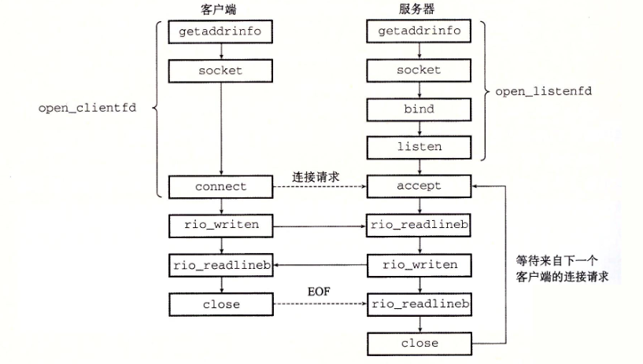

# 三次握手四次挥手发生在socket的哪个阶段
===

最近刚好在看网络编程,写服务器socket函数,刚好看到socket连接,想到了之前一直强调的三次握手四次挥手的问题.就找了一些资料写了这篇文章.正文其实很简单,就五张图片.其中前两张来自csapp,后两张来自网络,最后一张来自计算机网络.其中计算机网络(美国人写得第五版)描述的最清楚,感兴趣的话可以直接翻看原文.其中要注意四次挥手并不能保证两个端确认关闭成功,需要进行超时进行释放.理论上是会出现异常的情况.

===

给予socket的应用的发生过程如下,注意下图的几个io读写函数来自csapp.

客户端发起连接的状态

三次握手发生过程

四次挥手的发生过程

tcp自动机

