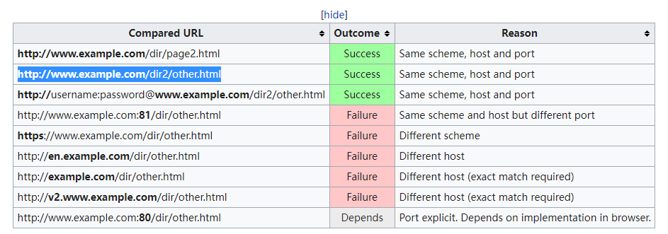

# 同源策略与cros
同源策略（Same Origin Policy）是一种约定，它是浏览器最核心也最基本的安全功能。可以说Web是构建在同源策略的基础之上的，浏览器只是针对同源策略的一种实现。实际上同源策略在浏览器上实现的更为完善.然后在小程序和一系列以浏览器为底的app(h5+webkit)也是要实现同源策略.可以说同源策略和在同源策略上实现的cros,是当今互联网的基石.然而正如同那个预言一样,鱼在水中,却很难感受不到水的存在.在平时的开发,我们几乎感受不到他的存在.我也是偶尔会代码的时候回复制一句Access-Control-Allow-Origin.

知道之前遇到了偶然机会一个cros策略错误,使用charles代理的时候遇到了https和http的降级问题,导致了chrome报了一个cros error的错误,才会想起学习这个问题.

### 同源要求
对于一个网址,他的同源要求如下
+ 协议相同
+ 域名相同
+ 端口相同

http://www.example.com/dir/page.html 这个网址，协议是http，域名是www.example.com，端口是80（默认端口可以省略）。它的同源情况如下。

>http://www.example.com/dir2/other.html：同源
>http://example.com/dir/other.html：不同源（域名不同）
>http://v2.www.example.com/dir/other.html：不同源（域名不同）
>http://www.example.com:81/dir/other.html：不同源（端口不同）
 
维基上的例子可能更详细一点 

### 同源策略的意义

浏览器的同源策略，限制了来自不同源的“document”或脚本，对当前“document”读取或设置某些属性。这也就构成了web安全的一个基石,当然我们也要明白同源安全归根到底只是一系列的规范,类似于http协议的那些基础要求,然后浏览器和基于浏览器的那些应用,以及后端的服务器与开发者,基于这些要求,建立了整个同源体系.这一套体系更像是防君子不防小人.我举一个例子,在日常开发中我们经常使用charles代理,来进行映射设置,从而回避了同源要求.
当然随着信息安全的发展,大家的规范也越来深,新一代的开发语言,框架,web技术都积极补漏,很多过去的web安全问题在现在也不再是问题.

### 同源策略的限制

（1） Cookie、LocalStorage 和 IndexDB 无法读取。

（2） DOM 无法获得。

（3） AJAX 请求不能发送。

Cookie 是服务器写入浏览器的一小段信息，只有同源的网页才能共享。但是，两个网页一级域名相同，只是二级域名不同，浏览器允许通过设置document.domain共享 Cookie。

如果两个网页不同源，就无法拿到对方的DOM。典型的例子是iframe窗口和window.open方法打开的窗口，它们与父窗口无法通信。

### 同一页面下的跨窗口通信

浏览器窗口有window.name属性。这个属性的最大特点是，无论是否同源，只要在同一个窗口里，前一个网页设置了这个属性，后一个网页可以读取它。父窗口先打开一个子窗口，载入一个不同源的网页，该网页将信息写入window.name属性。

### AJAX下的跨源通信

同源政策规定，AJAX请求只能发给同源的网址，否则就报错。

除了架设服务器代理（浏览器请求同源服务器，再由后者请求外部服务），有三种方法规避这个限制。

+ JSONP jsonp是利用了json通信的奇巧淫技,网页通过添加一个\<script\>元素，向服务器请求JSON数据,json的返回值作为自己的参数传入回调函数中
+ WebSocket 这个更像是跳过了http这一层,使用了socket通信技术,既然不在http这一层次,自然可以不用管逻辑
+ CORS

## CORS

CORS, "跨域资源共享"（Cross-origin resource sharing).CORS需要浏览器和服务器同时支持。核心就是通过一系列规则,规定了请求和返回包里面的head数据,自动添加一些附加的头信息，有时还会多出一次附加的请求，但用户不会有感觉。

对于[简单请求](https://blog.csdn.net/yexudengzhidao/article/details/100104134") (我们通常使用的请求)，浏览器直接发出CORS请求。具体来说，就是在头信息之中，增加一个Origin字段。

下面是一个例子，浏览器发现这次跨源AJAX请求是简单请求，就自动在头信息之中，添加一个Origin字段。

>GET /cors HTTP/1.1
Origin: http://api.bob.com
Host: api.alice.com
Accept-Language: en-US
Connection: keep-alive
User-Agent: Mozilla/5.0...

头信息中，**Origin字段用来说明，本次请求来自哪个源（协议 + 域名 + 端口）。服务器根据这个值，决定是否同意这次请求。**

如果Origin指定的源，不在许可范围内，服务器会返回一个正常的HTTP回应。浏览器发现，这个回应的头信息没有包含Access-Control-Allow-Origin字段（详见下文），就知道出错了，从而抛出一个错误，被XMLHttpRequest的onerror回调函数捕获。注意，这种错误无法通过状态码识别，因为HTTP回应的状态码有可能是200。

如果Origin指定的域名在许可范围内，服务器返回的响应，会多出几个头信息字段。

>Access-Control-Allow-Origin: http://api.bob.com
Access-Control-Allow-Credentials: true
Access-Control-Expose-Headers: FooBar
Content-Type: text/html; charset=utf-8

上面的头信息之中，有三个与CORS请求相关的字段，都以Access-Control-开头。

**（1）Access-Control-Allow-Origin 该字段是必须的。它的值要么是请求时Origin字段的值，要么是一个\*，表示接受任意域名的请求。**

（2）Access-Control-Allow-Credentials

该字段可选。它的值是一个布尔值，表示是否允许发送Cookie。默认情况下，Cookie不包括在CORS请求之中。设为true，即表示服务器明确许可，Cookie可以包含在请求中，一起发给服务器。这个值也只能设为true，如果服务器不要浏览器发送Cookie，删除该字段即可。

（3）Access-Control-Expose-Headers

该字段可选。CORS请求时，XMLHttpRequest对象的getResponseHeader()方法只能拿到6个基本字段：Cache-Control、Content-Language、Content-Type、Expires、Last-Modified、Pragma。如果想拿到其他字段，就必须在Access-Control-Expose-Headers里面指定。上面的例子指定，getResponseHeader('FooBar')可以返回FooBar字段的值。

### 非简单请求

这个内容上比较复杂,不过对于Restful架构的接口,大概率使用DELETE等复杂模式,这样就会使用非简单模式.
非简单请求的CORS请求，会在正式通信之前，增加一次HTTP查询请求，称为"预检"请求（preflight）。

浏览器先询问服务器，当前网页所在的域名是否在服务器的许可名单之中，以及可以使用哪些HTTP动词和头信息字段。只有得到肯定答复，浏览器才会发出正式的XMLHttpRequest请求，否则就报错。

具体内容这里就不展开说了,如果以后遇到与这个相关的问题在接受.

