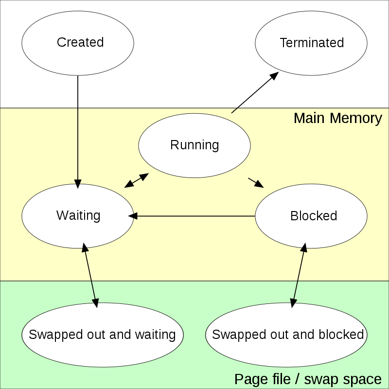

## docker的生命周期和进程的状态

最近在研究docker,刚好之前看到docker的生命周期这一块

看到docker生命周期这一块这几个名词怎么看的怎么眼熟啊,于是第一反应便是对应的进程的状态

 
随手找的图片,关于进程的状态可以参考操作系统,或者百科

于是我很容易联想到docker和进程之间肯定有着某些联系.

于是通过搜索和查看资料我得出的结论

>docker是以沙盒形式下包装起来的进程

>容器其实是一种沙盒技术。顾名思义，沙盒就是能够像一个集装箱一样，把你的应用“装”起来的技术。
一旦“程序”被执行起来，它就从磁盘上的二进制文件，变成了计算机内存中的数据、寄存器里的值、堆栈中的指令、被打开的文件，以及各种设备的状态信息的一个集合。像这样一个程序运行起来后的计算机执行环境的总和.

因此通过上面这些术语我们很容易便把docker技术里面很多看着生涩的名词对应到操作系统里面里面熟悉的关键词

|  docker   | 操作系统  |
| 镜像  | 程序 |
| 容器  | 进程 |

当然这样只是粗浅的理解,更为深入的理解,需要对于容器化技术,沙盒有更为深入的研究.总之本文只是我学习docker的一个小小体会.
