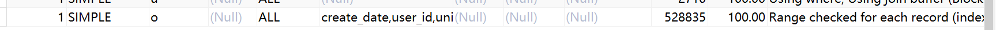

## mysql表关联的索引命中失败和由此带来的思考

###问题描述
最近翻了慢查询日志,大多数都是备份,夜晚的临时查询表生成,但是偶尔有几句是早年间留下的legend code留下的错误.有几个显示的问题
目前看来对于关联大表都要小心谨慎,尤其是关联条件的使用,本次出现的问题就在于join的on条件下过长导致的
虽然使用慢查询在生产环境中可以看到
LEFT JOIN `orders` `o` ON `u`.`user_id` = `o`.`user_id` and `o`.`chain_id` = '158' and `o`.`create_date` > '2022-01-01' and `o`.`create_date` < '2022-02-01'

>\# Query_time: 12.742334  Lock_time: 0.000586 Rows_sent: 4  >\Rows_examined: 17050666
>SET timestamp=1642946504;
......
>LEFT JOIN `orders` `o` ON `u`.`user_id` = `o`.`user_id` and `o`.`chain_id` = '158' and `o`.`create_date` > '2022-01-01' and `o`.`create_date` < '2022-02-01'

###问题分析
使用虽然explain可以看到索引没有命中,普通的索引都没有命中,给其他地方优化的联合索引也没命中(这和联合索引的左命中原理有关)

主要的原因在于orders表是大表,在关联后的命中索引失败后,他的产生的性能损失就很大.所以要想办法用其他方式命中索引.这里面涉及到很底层的mysql优化问题,我们普通的开发者是很难花时间去学习的.在这里我首先是查找了google,查了range checked for each record
,然后一个stack讨论很有意思(搜索引擎的使用是一个人的重要技能,马前卒有一句话很有意思,大多数人而言他们百度都没有使用的透彻)
https://stackoverflow.com/questions/54459775/mysql-join-between-range-checked-for-each-record-index-map-0x7

最后给的优化思路是吧on里面根据条件和订单表的索引的其他两个条件拆分出来,这样表关联中命中了user_id和chain_id
而 create_data放到了where语句中.虽然如此还要额外在写一句查询来匹配空出的数据.但是时间也拉到了正常的水平内.

### 思考
在mysql的慢查询中,出现过的问题要小心大表的,尤其是出现表关联后,虽然我们知道不同版本下的mysql优化也在不断地进步,很多早年间写的慢语句,建议都已经不在符合新版本.但是有几个核心的建议还是始终符合的.

- 大表的关联和查询都要小心,是否命中索引都要小心,一旦索引命中失败,带来的成本将是恐怖的.使用子查询提前命中索引后查出条目放入临时表.使用缓存把之前语句提前提取出来,使用多个短查询代替表关联.都是很好用的做法
- 对数量级要有敏感度,对于几千条表下,ALL(没命中索引)其实也是无所谓的.而达到几十万后,索引命中失败带来的压力就不容忽视.类似的类似bool类型索引实际上对于大表下他的优势就没有那么大了,即便命中了,带来的提升也没有那么大.再比如使用表关联后,一旦索引命中失败,那么即便是两个中等大小的表,他的乘积也会变成大表,这时候就要小心优化了.
  

