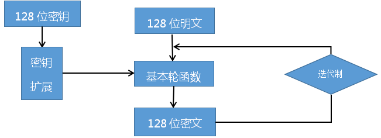
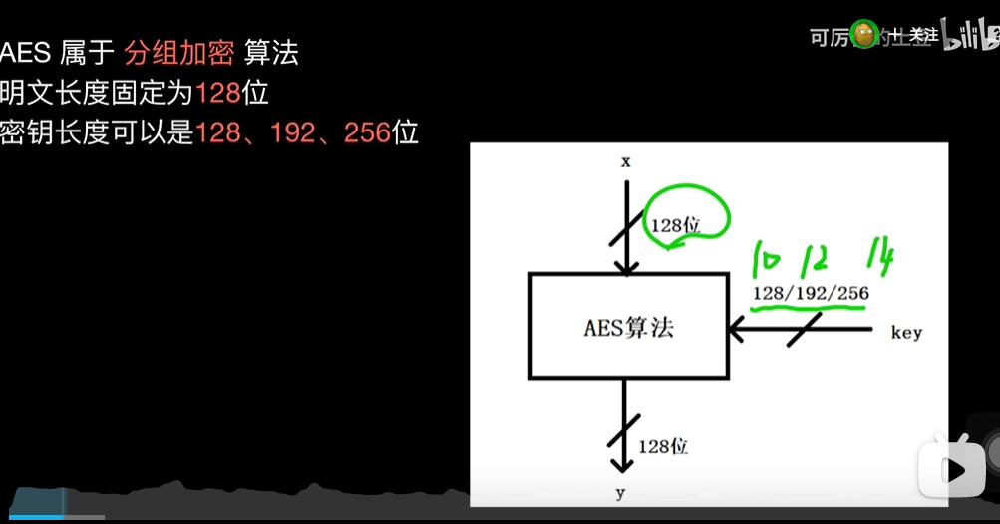

## aes加密算法概要

本文只是概要,具体实现请参考维基.本文的目的帮助记忆

#### 前置概念

aes是在sm4算法的为核心,对于des算法的攻击漏洞出现后进行的改造升级.关于大多数前置概念请参考[des加密](des.md)

#### sm4基本思路
以原始的sm4为例,因为这个逻辑更简单,包括des,aes都是在吃基础上进行升级

#### 秘钥长度和轮数

密钥的长度可以使用128位、192位或256位。密钥的长度不同，推荐加密轮数也不同

以下的思路是128秘钥的情况下处理

#### 整体加密过程

中间两个英文也叫行移位 列混合
注意最终轮没有只有前三步骤.没有第四步,列混合

#### 矩阵

AES的处理单位是字节，128位的输入明文分组P和输入密钥K都被分成16个字节

一般地，明文分组用字节为单位的正方形矩阵描述，称为状态矩阵。在算法的每一轮中，状态矩阵的内容不断发生变化，最后的结果作为密文输出。

#### 密钥加法层
在密钥加法层中有两个输入的参数，分别是明文和子密钥k[0]，而且这两个输入都是128位的。k[0]实际上就等同于密钥k，具体原因在密钥生成中进行介绍。我们前面在介绍扩展域加减法中提到过，在扩展域中加减法操作和异或运算等价，所以这里的处理也就异常的简单了，只需要将两个输入的数据进行按字节异或操作就会得到运算的结果。

#### 字节代换层
字节代换层的主要功能就是让输入的数据通过S_box表完成从一个字节到另一个字节的映射，这里的S_box表是通过某种方法计算出来的

读取S_box数据的方法就是要将输入数据的每个字节的高四位作为第一个下标，第四位作为第二个下标，略有点麻烦。这里建议将其视作一维数组即可。逆S盒与S盒对应，用于解密时对数据处理，我们对解密时的程序处理称作逆字节代换，只是使用的代换表盒加密时不同而已。

s盒  s逆盒也类似

#### 行位移——ShiftRows
行位移操作最为简单，它是用来将输入数据作为一个4·4的字节矩阵进行处理的，然后将这个矩阵的字节进行位置上的置换。ShiftRows子层属于AES手动的扩散层，目的是将单个位上的变换扩散到影响整个状态当，从而达到雪崩效应。

正向行位移图解

逆向行位移图解

#### 列混淆——MixColumn
列混淆子层是AES算法中最为复杂的部分，属于扩散层，列混淆操作是AES算法中主要的扩散元素，它混淆了输入矩阵的每一列，使输入的每个字节都会影响到4个输出字节。行位移子层和列混淆子层的组合使得经过三轮处理以后，矩阵的每个字节都依赖于16个明文字节成可能。其中包含了矩阵乘法、伽罗瓦域内加法和乘法的相关知识。

#### 子秘钥生成

子密钥的生成是以列为单位进行的，一列是32Bit，四列组成子密钥共128Bit。生成子密钥的数量比AES算法的轮数多一个，因为第一个密钥加法层进行密钥漂白时也需要子密钥。密钥漂白是指在AES的输入盒输出中都使用的子密钥的XOR加法。子密钥在图中都存储在W[0]、W[1]、...、W[43]的扩展密钥数组之中。k1-k16表示原始密钥对应的字节，而图中子密钥k0与原始子密钥相同。

#### AES解密流程图

注意区别 刚好顺序是加密反过来的.区别是字节代换层变成了逆字节代换层

