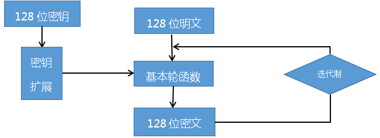
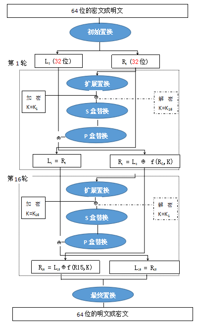
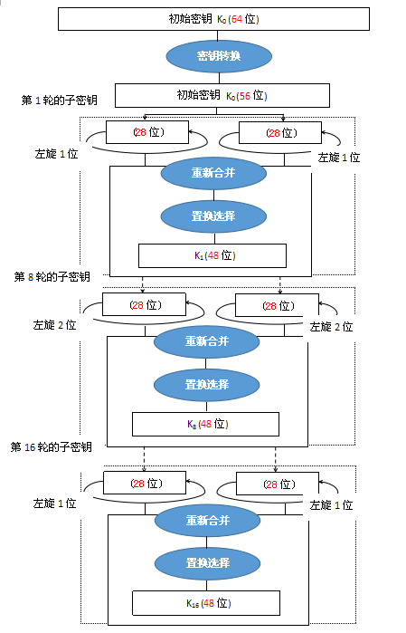

## des算法概要

本文只是基本逻辑的汇总,并不涉及到代码的细节.具体的实现可以参考维基或者这个b站[视频](https://www.bilibili.com/video/BV1KQ4y127AT?spm_id_from=333.999.0.0)

### 基本概念解析
一下解释一些可能会难理解的名词

#### 秘钥
就是一串特殊的串,可以理解为钥匙.密码学的一个基础就算秘钥,就算算法被发现,只要秘钥不被攻击方发现,就可以保证不会出问题

#### 扩散和混淆
扩散就是让明文中的每一位影响密文中的许多位，或者说让密文中的每一位受明文中的许多位的影响．这样可以隐蔽明文的统计特性。

混淆就是将密文与密钥之间的统计关系变得尽可能复杂，使得对手即使获取了关于密文的一些统计特性，也无法推测密钥。使用复杂的非线性代替变换可以达到比较好的混淆效果，而简单的线性代替变换得到的混淆效果则不理想。

这个两个原则是现代密码学的核心,也是des算法设计的基本原则

#### 雪崩效应
雪崩效应（Avalanche effect）指加密算法（尤其是块密码和加密散列函数）的一种理想属性。雪崩效应就是一种不稳定的平衡状态也是加密算法的一种特征，它指明文或密钥的少量变化会引起密文的很大变化。
#### 对称加密

采用单钥密码系统的加密方法，同一个密钥可以同时用作信息的加密和解密，这种加密方法称为对称加密，也称为单密钥加密。

#### 分组密码
sm4 des aes都是都是类似的逻辑,对于比较长的文本,对划分为各个组,每一组分别加密,生成一组密文,解密的时候也是分别对于各个分组进行加密.

#### 轮函数
本质上一组明文,需要经历多轮,进行迭代多次计算,实际上轮的概念在之后的哈希函数里面也会出现

### sm4基本思路
以原始的sm4为例,因为这个逻辑更简单更是和作为图看好

这个概念有了之后可以再看des算法就简单了

### des算法流程图

DES算法通常都是在硬件中实现。DES算法中的图表和术语（通过线、框画的流程图，以及诸如S盒、P盒这样的术语）使其更倾向于在硬件中实现

#### 置换和逆置换

置换64位的数据块开始，该置换过程称为初始置换。该过程并不会增加DES的安全性，但这种做法在16位和32位的总线出现之前将使得数据更容易加载到DES芯片中。虽然这种处理已经不合时宜，但该置换过程仍然保留以满足DES标准。

对应的之后会有逆置换.最后一步是将R16L16按照表8所示的置换进行置换。简而言之，就是撤消之前的初始置换。

#### 秘钥生成
由于des算法需要进行16次重复的轮函数运算,每一轮都需要输入的秘钥,因此要对秘钥进行一组算法,生成16个不同的子秘钥

#### 轮函数

经过初始置换后，64位的数据块分为两个32位的组，L0和R0。完成初始置换后，数据块将重复执行16轮一系列的操作。

以下我个人的建议是只看关键词即可,里面的什么名词除非你有必要重写,否则没必要关注具体实现
##### 扩展置换
每一轮以Li-1和Ri-1开始，然后根据表5所示进行扩展置换，将Ri-1从32位扩展到48位。该置换的主要目的是在加密数据的过程中制造一些雪崩效应，使用数据块中的1位将在下一步操作中影响更多位，从而产生扩散效果。
#### S盒
Rint 需要通过8个单独的S盒执行8次替换操作。每个S盒（j）从Rint的6j 到 6j+6 的位置取出6位，并为其在表6中查出1个4位的值，将该值写到缓冲区的4j位置处（如图3）。

#### P盒置换与下一轮

一旦完成了S盒替换，得到的结果又变为一个32位的值。接下来再通过P盒来置换

每一轮的最后一个操作是计算 f 的32位结果值与传入本轮操作的原始数据的左分组Li-1之间的异或值。

一旦完成，将左右两个分组交换然后开始下一轮。

在最后一轮中，不用交换左右分组。

#### 加解密

加密数据时，最终结果就是一个64位的密文，而当解密数据时，最终结果就是64位的明文了。要对密文进行解密可以采用同样的步骤，只是子密钥是按照逆向的顺序（16-1）对密文进行处理