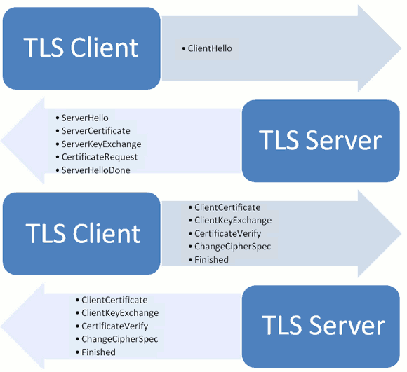

## SSL和TLS简单概述

本文不会只有几个比较重要的概念,科普性质的文章,方便自己记忆,极大概率存在缺陷
如果想了解这方面的内容，请参阅[官方文档](https://datatracker.ietf.org/doc/html/rfc5246)。

### SSL和TLS
TLS是更安全版本的ssl,先出的的ssh,一个基于加密机制的应用,之后为了方便给其他应用层使用然后引入了ssl,最后是升级版的tls.

SSL是位于可靠的面向连接的*网络层协议和应用层协议*之间的一种协议。HPPTS是HTTP over SSL/TSL,Https默认使用端口443.

###前置概念

首先是几个前置概念的理解,如果没办法理解这几个前置概念,后文中的内容就好像读天书,里面那些博客的内容估计也读不懂

##### 对称加密和非对称加密 
这一点我建议是可能一些专业书籍,
当然这一篇文章也可以
https://blog.csdn.net/u014294681/article/details/86705999

知道非对称加密的几个概念公钥,私钥, 对称加密效率跟高但是更容易被攻击

##### 公钥,私钥
这两个概念就是在前文中非对称加密中出现,简单的说就是私钥保存在自己手中,公钥在公网上流传.用公钥进行加密,用私钥进行解密

##### 证书 签名 
然后是证书 签名  这个概念参考这两篇文章即可,本文中数字签名并不一定和ssl有关,比如下载文件的时候就喜欢用md5校验签名.
https://www.cnblogs.com/itps/p/12359865.html
https://ruanyifeng.com/blog/2011/08/what_is_a_digital_signature.html
本文中有一个细节要注意,因为客户端苏珊只有公钥,因此签名的加密发送反过来的.
核心就是将公钥放在数字证书中。只要证书是可信的，公钥就是可信的。

##### 对话密钥
公钥加密计算量太大,所以不可能全程采用非对称加密,因此非对称加密阶段目的是为之后对称加密做准备.对话秘钥是给对称加密使用的秘钥,这一点请参考1提到的对称加密的概念

每一次对话（session），客户端和服务器端都生成一个"对话密钥"（session key），用它来加密信息。由于"对话密钥"是对称加密，所以运算速度非常快，而服务器公钥只用于加密"对话密钥"本身，这样就减少了加密运算的消耗时间。

### 简要流程

因此，SSL/TLS协议的基本过程是这样的：

（1） 客户端向服务器端索要并验证公钥。

（2） 双方协商生成"对话密钥"。

（3） 双方采用"对话密钥"进行对称的加密通信。

其中1 2是非对称加密阶段  3 是对称加密阶段

然后更为详细具体的流程可以参考

http://www.ruanyifeng.com/blog/2014/02/ssl_tls.html
https://www.jianshu.com/p/1fc7130eb2c2

（1） 客户端向服务器端索要并验证公钥。一般是非对称加密  
核心,如何交换公钥和防止被攻击

第一轮 存在交换 SSL/TLS 版本号和所支持的加密算法等各种信息,以及对话加密的随机数,

第二轮 交换证书,主要是服务器返回证书,然后客户端也有可能需要证书(秘钥狗模式) 当然这一轮两次都不一定需要(主要是 后一种,服务器返回证书通常是也就是我们证书 )

证书的意义在于可信的加密传递公钥,防止中间人攻击

至此 证书和公钥交换结束 同时也交换了

这两轮 ,实际上这两轮可能是好几轮,而在另外的文章中这是是只有一轮,对应的是 ClientHello 和 SeverHello

第二轮结束  此时可能需要客户端校验服务器证书,这一阶段可能会存在攻击的隐患,比如之前诱导客户添加可疑的证书

第三轮 首先是客户端发送 
随机数用服务器公钥加密，防止被窃听。同时如果是之前用了秘钥狗,这里也可能对客户端公钥进行加密
编码改变通知，表示随后的信息都将用双方商定的加密方法和密钥发送。
前面发送的所有内容的hash值，用来供服务器校验。同时也表明 客户端握手结束通知

客户端先向服务器端索要公钥，然后用公钥加密信息，服务器收到密文后，用自己的私钥解密。

服务器的最后回应

（1）编码改变通知，表示随后的信息都将用双方商定的加密方法和密钥发送。

（2）服务器握手结束通知，表示服务器的握手阶段已经结束。这一项同时也是前面发送的所有内容的hash值，用来供客户端校验。

注意这一轮最为重要的事情,是生成会话密钥,之后算法用会话秘钥进行对称加密通信

接着双方就用事先商定的加密方法，各自生成本次会话所用的同一把"会话密钥"。

（2） 双方协商生成"对话密钥"。

解决方法：每一次对话（session），客户端和服务器端都生成一个"对话密钥"（session key），用它来加密信息。由于"对话密钥"是对称加密，所以运算速度非常快，而服务器公钥只用于加密"对话密钥"本身，这样就减少了加密运算的消耗时间。
（3） 双方采用"对话密钥"进行加密通信。加密通话一般采用效率更快的对称加密形式实现

### 杂项

关于tsl的性能问题,如果你对于计算机网络有一定的了解,可以看看
https://www.infinisign.com/news/tls-13-new-pro
也可以参考各类文章,简单地说tsl大大提高了延迟,当然tcp http tsl的各项版本升级都在延续如何加入持久化的技术,减少往返次数

关于tsl的攻击

https://www.zhihu.com/question/28396919
参考这一篇文章
