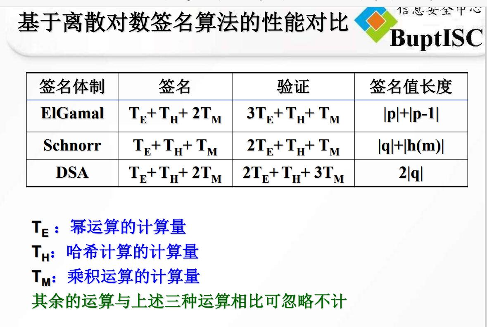

## 非对称加密比较

本文不会上传,只是作为面试的关键点记忆.

### RSA系统
原理 
将两个大质数相乘十分容易，但是想要对其乘积进行因式分解却极其困难，因此可以将乘积公开作为加密密钥。

####  加解密
RSA的加密过程可以使用一个通式来表达
密文=明文^E mod N
RSA解密
明文 = 密文^D mod N

公钥 = （E，N）  私钥＝(D,N)

#### 公钥私钥选择
公钥是 （E，N）私钥是 (D,N)
E是加密（Encryption）的首字母，N是数字（Number）的首字母。

准备两个质数p，q。这两个数不能太小，太小则会容易破解，将p乘以q就是N

N = p * q

求L（L为中间过程的中间数）
L 是 p－1 和 q－1的最小公倍数，可用如下表达式表示

L=lcm（p－1，q－1）

在给一个质数
E必须满足两个条件：E是一个比1大比L小的数，E和L的最大公约数为1

数D是由数E计算出来的。D、E和L之间必须满足以下关系：

1 < D < L
E＊D mod L ＝ 1

只要D满足上述2个条件，则通过E和N进行加密的密文就可以用D和N进行解密。

有上面可知,需要准备三个素数p q E

### 离散对数系统

任何循环群G上。它的安全性取决于G上的离散对数问题

比较有名 ElGamal算法

ElGamal数字签名
 Schnorr数字签名
 DSA数字签名

#### 秘钥选择

（1）Alice利用素数g产生一个q阶循环群G的有效描述。该循环群需要满足一定的安全性质。q本身也是一个素数

（2）Alice从中随机循环群G选择一个x。
（3）Alice计算h = g^x mod p 
（4）Alice公开(h,循环群G的描述
)作为其公钥，注意这里循环群G包含q,g两个信息

并保留x作为其私钥。私钥必须保密。

### 加解密
设明文为M，发送方选择一个随机整数k （k与g-1互素）
a=g^k mod q
b=y^k*M mod q
则密文为（a，b）
 
3) 解密
M=b/a^x mod p

#### 
ElGamal数字签名
 Schnorr数字签名
 DSA数字签名

 这三个都是签名算法,主要是使用公式不一样
 其中DSS出现的最晚,所以改进之后，秘钥长度不同下,生成签名的长度不同,具有较大的兼容性和适用性.

 

### 椭圆曲线密码
ECC算法
SM2签名算法

椭圆曲线的离散对数问题上的密码体制

### 公钥私钥获取
给定椭圆曲线上的一个点G，并选取一个整数k，求解K=kG很容易(注意根据kG求解出来的K也是椭圆曲线上的一个点)；反过来，在椭圆曲线上给定两个点K和G，若使K=kG，求整数k是一个难题。ECC就是建立在此数学难题之上

选择一个椭圆曲线E: y2=x3
-x(mod p)，构造一个椭圆群Ep(-1，
0)。
 在Ep(-1，0)中挑选生成元点G=(x1，y1
)，G应使得满足nG＝ O最小的n是一个非常大的素数。
 选择一个小于n的整数d作为其私钥，然后产生其公钥P＝dG。

注：公开的信息：(E，G，n，P)(E是构成椭圆的参数,n是选择的一个素数,用椭圆E和素数n,生成G,P是有d和G生成的一个数)
d是私钥

### 加解密算法
1、用户B接到信息后 ，将待传输的明文编码到Ep(a,b)上一点M（编码方法很多，这里不作讨论），并产生一个随机整数r。
2、用户B计算点C1=M+rK；C2=rG。
3、用户B将C1、C2传给用户A。
加密文(C1、C2)用来传输

解密
用户A接到信息后，计算C1-kC2，结果就是点M。因为 C1-kC2=M+rK-k(rG)=M+rK-r(kG)=M再对点M进行解码就可以得到明文。

 

