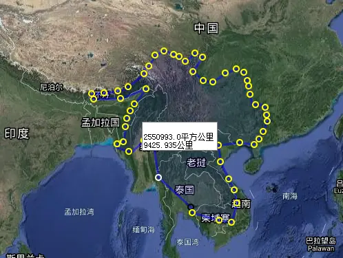

## 书评: 逃避统治的艺术

本周看了两本书,一本是这个,另一本是血酬,血酬写的着实一般.不过也算是看了过.这本书看着是很有趣味开阔了眼界,当然本书作为所谓的安那其主义者(无政府主义者)的狂欢作,我看到挺多二次元安那其爱好者推荐的.这个倾向很重要,读的时候一定要警醒自己不要被作者带跑偏了

### 作者与倾向
本文的味道里面确实透露出一股子歌颂无政府主义和憎恨集权国家的倾向.

但是看这本书之前一定要弄清楚一点,本书作者詹姆斯·C·斯科特,是拿了cia的钱,写这本书歌颂无政府主义安拿其的时候采访了一堆东南亚的人的时候,也把这些人的名单给了cia.
详情请见[如何评价詹姆斯·C·斯科特？](https://www.zhihu.com/question/516517813)
明白这一点读的时候,才能避免不要被作者带跑偏了
盛名之下其实难副，可以翻翻，但不可尽信.本书论述过程称不上严谨，而且冗长重复.我读到一半就觉得很多部分是重复的,非常无趣.

### 赞米亚
  “赞米亚”（Zomia）是由荷兰阿姆斯特丹大学历史学家威廉·冯·申德尔于2002年提出的地理术语，指的是历史上位于低地人口中心的政府无法控制的大面积的东南亚大陆。这一片从贵州到云南一直延伸到缅甸老挝.横跨东南亚的五个国家（越南、柬埔寨、老挝、泰国和缅甸）以及中国的四个省（云南、贵州、广西和四川部分地区）

本书中深化了对这一概念的理解，用以描述所有海拔在300米以上的东南亚高地。特点就是山高林茂密,地形复杂,人口稀少,政府想要统治几乎非常困难.
在中国,这一块虽然很早就被汉代有一部分朝贡,在三国演义里面也屡屡出场(七擒孟获).但是要一直到明代才开始建立有效统治,并且一直有暴乱和起义.

#### 黎人和临高启明
如果要对这一片土地有一定的了解,可以看通俗小说临高启明中 第五十一节 黎区工作 以及之后众多关于黎区的描写.

简单的说就是基本没有明政府的统治,只是不需要缴纳赋税,只需要在某些时候经过交易才会进入大明境内参战.
由于地形因素,要到达黎人村寨是非常苦难,本书中考察队花了好多天时间才到达一个村寨.而在书中描述下基本上也只有两条腿的小贩偶尔回到到来.因此明代官府几乎不可能对本地形成统治.反而是海南的黎人还会进行暴乱,攻打县城.

### 交通阻塞、远离行政管理
上文中提到了临高启明,也体现出该地区一个重要因素.
 交通阻塞、远离行政管理，这是造成这一地区社会关系的关键因素，称为地形阻力.因为本地热带雨林气候,地形上有事高原纵横地形,形成了大量被隔离开的小坝子.一个个天然的远离统治的村落.如果不是现代的工业发展,本地估计依旧是山高路远,基本不会被国家所统治.

### 山民与蛮夷
国家总是试图将山地的居民集中到平地，从事水稻种植，而山民则通过各种方式来逃避国家的控制。传统的观点将山地的居民看做是落后和野蛮的，国家政权延伸到这些地区被看做是推动了这些地方的进步。但是斯科特通过对这个地区历史的研究发现，看起来似乎是落后的山地少数民族可能并不落后，他们居住在山上，选择了不同于谷地的生活和生产方式是因为他们希望借此逃避国家的统治.

面对一个与人民相对立的国家，底层人群的策略有两个，或者反抗，或者逃避《逃避统治的艺术》一书中则讨论了后一种策略，人们如何逃避国家的统治。

在前现代化时期，人们之所以能够逃避，是因为古典王国有着一个致命的弱点，就是对集中的人口和农业的依赖。赋税和徭役的征收是需要成本的，如果成本过高，那么无论是赋税或徭役都是没有意义的.

跑路山地,政府征税小吏也就很难把手伸向那里.同样的你跑路山地自然也就选择逃离文明.自愿变成蛮夷.
在我国的南方历史中,一直有这么一种理论,那就是根据更远地方的方言,反而更接近更古代的语言.当然这套理论貌似已经被推翻.但是我先说的是蛮夷,或者说少数民族,很多都是更早以前跑路的中原人,这一理论是已经被证实的

### 桃花源记
本书作者花了很大篇幅渲染了,人民为了逃离统治,跑路到山区,从此过上了没有官府的幸福生活,哇哦.好一副桃花源记

>初极狭，才通人。复行数十步，豁然开朗。土地平旷，屋舍俨然，有良田美池桑竹之属。阡陌交通，鸡犬相闻。其中往来种作，男女衣着，悉如外人。黄发垂髫并怡然自乐

在这里“国家”被认为是压制性的、残暴的，现代人“生活在一个被完全控制、一个具有日益标准化制度模块的世界”令人畏惧；相比而言，那些逍遥于这一秩序之外的高地族群则可以抵御国家暴力，并生活在平等自由的社会结构之中.但是真的是这样的?
我看过不少关于明代流民的描写,也有建国早期关于黎民的描写,里面的生活并不是那么的舒服.我们要明白一点本书作者的倾向和写作本身是选择性的,舒服的远离政府的田园牧歌,本身就是脆弱的,远离文明的,按照临高启明的说法,在城市空调房里面幻想着田园牧歌美好生活的小文青们,真把他们扔到郊外没有马桶的生活,他们一定会哭着喊着要爬回城市

### 蛮夷 华夏 流民

孔子说“夷狄入中国，则中国之，中国入夷狄，则夷狄之”.我看明代资料里面很多边疆居民受不了苛捐杂税也跑路蒙古,自愿成为蒙古族.
本书中也花了一部分篇幅描述这一理论.受不了政府统治的人民,跑路山林之中,这算是一种反抗.无须纳税，他们自耕自食.

比如明代荆襄流民,襄地区北有秦岭，南有大巴山，东有熊耳山，中有武当山、荆山，跨连陕西、河南、湖北三省，谷阻山深，人烟稀少，为封建统治的薄弱环节。该地资源丰富，且可逃避赋役，永乐年间(1403～1424)渐有流民进入。宣德至成化年间，流民集结者逾一百五十万.经历了一系列暴乱,起义,镇压,抚治,但是最后依旧没有妥当解决.

但是本书不知道是不是刻意,忘记了还有另一种在中国历史很常见的叙述,就是把人从蛮夷山民拉回到政府管理中,这种一般被认为是一种善政.
比如王阳明在南赣,新中国在海南,贵州干的事情一样.
可能这也是为什么白左思维里面,把中国干的扶贫思维一种暴政的奇怪思维.远离政府是好的,田园牧歌是好的,来城市里面打工是坏的.呃呃

### 水稻是坏的 块茎是好的
东南亚农业是以水稻种植业为主，将大量人口束缚在固定的土地上以便于管理和征收税赋的谷地国家，斯科特认为，如果要想象一种完美的便于治理的国家，就应该当是这样的，将人口和土地完全结合，而国家可获的生产总值必须是容易识别、监督和计数的，而且在地理位置上距离应当足够近（便于征收）.
而块茎则便于隐藏,不容易收税,适合给高地居民食用,这一点我之前分析中国清代的红薯土豆产量时候说过,对于国家政权来说,水稻小麦精粮便于买卖换成赋税缴纳.而红薯高产之外不便储存,不能缴纳皇粮国税.这也是在统治没有撕裂的清代中前期红薯只是补充作物,而水稻等谷物依旧占据主导地位.

而在民国时代,因为国家的崩坏,红薯土豆反而大大扩张.
本书中有好几章描述这两种作物的对比,很是有趣.

#### XX
阅读完了之后有一种奇怪的感觉.本文隐隐觉得与主流叙事处处作对，将前国家变成后国家，似乎也只能是一种可选择的视角.大概是想抨击某些东西吧

