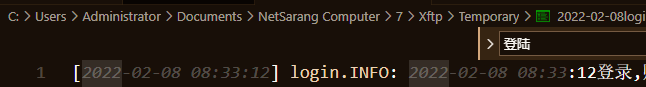
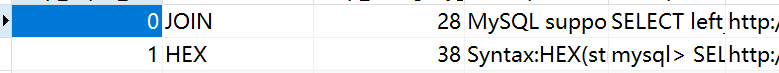

## linux日志查看常见方法

作为一个常年的码农,常年与日志打交道,我自己常用的日志就有各种linux访问日志,php错误日志,nginx访问日志,mysql慢日志....
那么日志是如何查看与分析呢?这里的核心主要是把我见到的常用的一些方法给出来.

### 入门版本

#### 使用linux命令
使用各种常用命令  tail、cat、tac、head、echo, 除此之外结合管道分析grep,正则表达式
[Linux 6种日志查看方法](https://cloud.tencent.com/developer/article/1579977)

[grep命令详解](https://www.runoob.com/linux/linux-comm-grep.html)

这里举一个例子,比如我现在要查看history命令里面之前常用的一个命令.
我现在先找到.bash_history,他是之前敲击命令的例子,现在我想通过tail命令拿到最后敲击的10行,之后运用grep找到对应的我想要找到的行

#### 使用图形化软件查看
主要是针对小日志,例如常用的日错误日志,直接用ftp下载到windows,或者直接用ftp打开,用常用的图形化软件查找.windows下面的各种图形化软件,界面查看完善,看着也舒服,作为入门级别的查看日志工具其实是很快的,就是感觉low了点,没有啥科技感,但是胜在简单实用,小白也能很快掌握,不需要记忆那些命令

速度也可以,如果是大日志,那么用这种方法就要对软件有一定的要求了,这边也不建议这么干

### 升级版本

升级版本就是纯粹是作者自由发挥本质上还是信息收集能力,有大手子可以补充.

#### 结合数据库
通过程序把日志写入数据库,结合navicate之类的图形化数据库管理工具,可以方便查看,结构化查询语言最大的优势就在于此,如果你的数据库功底不错,那么结合sql语句可以查出花来

##### 日志的转化
那么你现在手里面有一套日志,如何导入sql呢?
首先是可以查找别人写好的程序,这个就需要考验你的信息收集能力,这个其实真的建议任何一个生活在现代的人学习,马前卒,双尾彗星这些up经常再说这件事情.如何使用搜索引擎,如何使用github,如何知道在哪里搜索都是技术

比如mysql的binlog,参考这一篇
[使用mysqlbinlog将binlog日志转为sql文件](https://jingyan.baidu.com/article/5553fa828ff46165a2393412.html)

当然绝大多数常用的日志系统,应该都会有前人写成程序了,实在不行自己写一个py程序写入sqlit,也是非常快的.

#### 日志收集

日志收集指的是你的日志从一开始就不一定要写入到文件系统中,这个需要个人配置,比如我常用的php日志系统,通过流系统,可以写入到文件(默认),也可以写入到mysql,redis,甚至更高级的其他的分布式日志文件系统中.

例如系统日志,可以参考使用Rsyslog
[日志管理工具Rsyslog](https://www.jianshu.com/p/e129ed893362)

比如对于防火墙系统iptable,可以把iptable的日志收集到其他地方
[使用rsyslog单独保存iptables log日志实践](https://www.jianshu.com/p/ff922a289f94)

### EFK (Elasticsearch + Fluentd + Kibana) 日志分析系统

终极大法,这个实际上已经是基本上在日志管理系统中已经属于顶配版本.就是全程用各类专业软件收集和分析
>EFK 不是一个软件，而是一套解决方案。EFK 是三个开源软件的缩写，Elasticsearch，Fluentd，Kibana。其中 ELasticsearch 负责日志分析和存储，Fluentd 负责日志收集，Kibana 负责界面展示。它们之间互相配合使用，完美衔接，高效的满足了很多场合的应用，是目前主流的一种日志分析系统解决方案。

但唯一的问题就是EFK,需要大量配置,而且需要大量的资源(人力成本,开发成本,服务器资源),本身已经是企业级的方案,如果本身是公司的日志系统,上EFK就无可厚非.个人那来玩的东西,用这个就有点杀鸡用牛刀了

