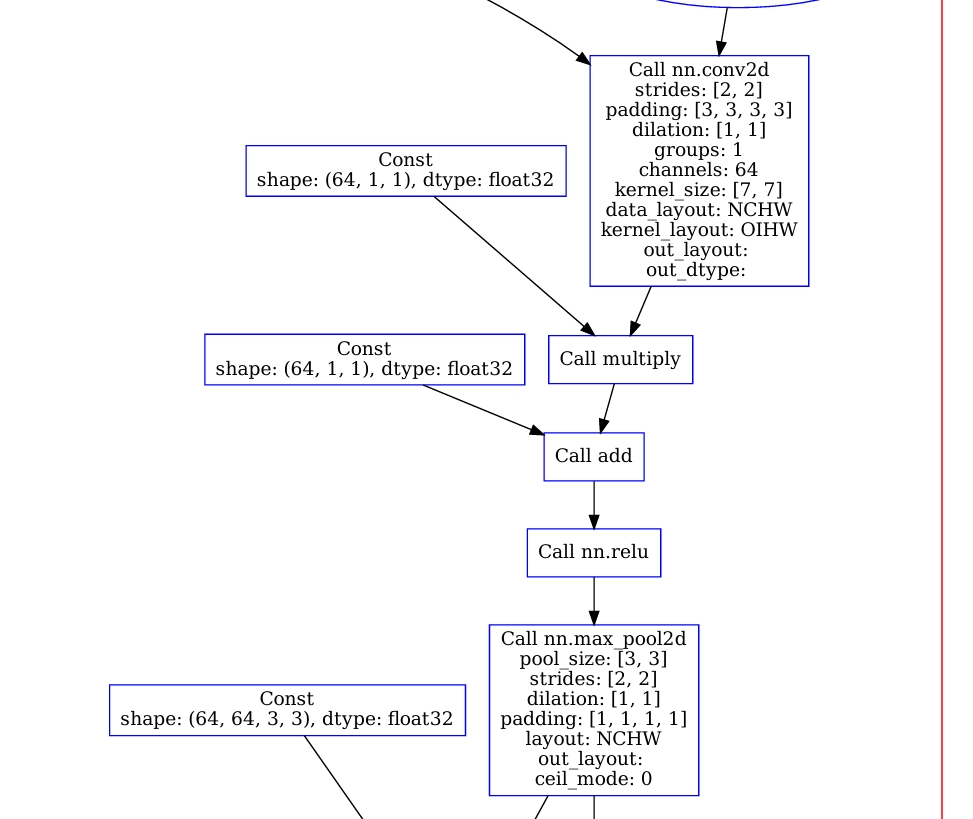
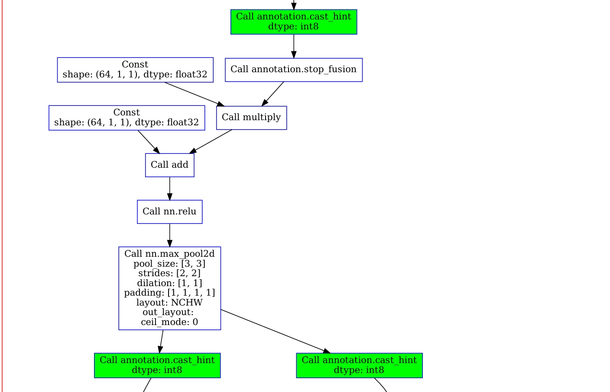

# tvm量化与思考

本来想要做基于tvm的[smooth quantization](https://www.bilibili.com/video/BV1KV4y1t79C/?spm_id_from=333.999.0.0&vd_source=e77a40b73ffa6765f5b0ae7ff943fc8b),但是后来发现难度比较大,而且使用tvm量化添加对应的pass来实现smooth quantization的办法,似乎并没有先提前用校正来的参数来向smooth模型之后在进行tvm优化与量化.

不过这两个星期也算是对于tvm的量化有了一定的认识,所以整理了一下内容.

## 主要参考内容

[【我与TVM二三事 中篇（4）】quantize](https://zhuanlan.zhihu.com/p/457823589)
[Search-based Automated Quantization](https://discuss.tvm.apache.org/t/rfc-search-based-automated-quantization/5483)
[代码](https://tvm-book.readthedocs.io/zh-cn/latest/chaos/quantize/index.html)
视频[TVM的量化框架](https://www.bilibili.com/video/BV1ur4y197zj/?spm_id_from=333.788.videopod.sections&vd_source=e77a40b73ffa6765f5b0ae7ff943fc8b)
论文:面向深度学习编译器的多粒度量化框架支持与优化_魏铭康.pdf
关于论文主要内容是基于给量化添加per channel的逻辑,不妨碍理解,不过他视乎少了partition(分区)好吧

推荐工具: [Relay IR Visualizer](https://tvm.apache.org/docs/reference/api/python/contrib.html)

tvm提供的查看relay的工具,挺好用


print(mod['main'])python级别打印,可以看到各个funtion的情况


## 阶段分析

关于基础实现可以参考这一篇

[Deploy a Quantized Model on Cuda¶](https://tvm.apache.org/docs/v0.10.0/how_to/deploy_models/deploy_quantized.html)
这一篇就是实现基于把一个未量化的模型放到tvm中进行量化

核心代码是这样的

```C++
with relay.quantize.qconfig(calibrate_mode="kl_divergence", weight_scale="max"):
    mod = relay.quantize.quantize(mod, params, dataset=calibrate_dataset())
```

基于对应的设置(qconfig),我这里认为比较重要的两个一个是calibrate_mode,确定校正模式,一个是partition_conversions 
这个对应的一个pass-partition,partition_conversions 注释如下:

```
If set to 'enabled' or 'fully_integral', partitions a quantized result into a module containing a prefix function (consisting of input conversion into the quantized data space), a middle function (consisting of the core quantized network), a suffix function (consisting of output dequantization), and a main function (that calls the prefix, middle, and suffix functions in succession). If set to 'fully_integral' and there are unquantized operators in the result, an exception is raised. The default value is 'disabled'.
```

我的理解是分区的意义在于把特定算子区域执行融合,然后在一整组的算子进行统一的量化,比如通过划分,把几个算子比如add nn_relu都划在一个分区,统一进行量化.

tvm/python/tvm/relay/quantize/quantize.py

这个函数是quantize的入口函数,由于是python文件,因此是可以允许自己进行自由的修改,不需要额外的编译.

``` python
def quantize(mod, params=None, dataset=None):
    """The quantization procedure. Before running the three main
    procedure of quantization, "annotate", "calibrate" and "realize"
    , we need to do "SimplifyInference", "FoldScaleAxis", "FoldConstant"
    first for optimizing.

    Parameters
    ---------
    mod: Module
        The original module.

    params : dict of str to NDArray
        Input parameters to the graph that do not change
        during inference time. Used for constant folding.

    dataset: list of dict of Var -> NDArray
        The calibration dataset.

    Returns
    -------
    ret: Function
        The graph after quantization
    """
    mod = prerequisite_optimize(mod, params)
 
    calibrate_pass = tvm.transform.module_pass(
        calibrate(dataset), opt_level=1, name="QuantizeCalibrate"
    )
    quant_passes = [partition(), annotate(), calibrate_pass, tvm.relay.transform.InferType()]
    if not current_qconfig().do_simulation:
        quant_passes.append(realize())
    quant_passes.append(_transform.FoldConstant())
    quantize_seq = tvm.transform.Sequential(quant_passes)
    
    with tvm.transform.PassContext(
        opt_level=3, required_pass=["QuantizeAnnotate", "QuantizeCalibrate", "QuantizeRealize"]
    ):
        with quantize_context():
            mod = quantize_seq(mod)

    q_cfg = current_qconfig()
    assert q_cfg.partition_conversions in ["disabled", "enabled", "fully_integral"]
    if q_cfg.partition_conversions != "disabled":
        quantized_dtypes = {q_cfg.dtype_input, q_cfg.dtype_weight, q_cfg.dtype_activation}
        ensure_fully_integral = q_cfg.partition_conversions == "fully_integral"
        return partition_conversions(mod, quantized_dtypes, ensure_fully_integral)

    return mod
```

### 预先添加pass

上面的代码我们看到,prerequisite_optimize函数,这里我们可以根据自己的需求,额外的添加pass优化

```python
def prerequisite_optimize(mod, params=None):
    """Prerequisite optimization passes for quantization. Perform
    "SimplifyInference", "FoldScaleAxis", "FoldConstant", and
    "CanonicalizeOps" optimization before quantization."""
    optimize = tvm.transform.Sequential(
        [
            _transform.SimplifyInference(),
            _transform.FoldConstant(),
            _transform.FoldScaleAxis(),
            _transform.CanonicalizeOps(),
            _transform.FoldConstant(),
        ]
    )

    if params:
        mod["main"] = _bind_params(mod["main"], params)

    mod = optimize(mod)
    return mod
```
#### 预处理后
这里其实主要的目的是和后面分区进行比较


### partition 分区

``
调用流程：
1 ForwardRewrite遍历：
1.1 ForwardRewriter::VisitExpr -> ForwardRewriter::Rewrite_
2 FQPartitionRewrite修改：
  2.1 partition_expr_check(检查输入是否是QPartitionExpr)
    2.1.1 arg.realize(添加cast_hint和stop_fusion)
  2.2 QPartitionExpr(包装输出)
``

@ tvm/python/tvm/relay/quantize/quantize.py
进行调用,这里_quantize表明这是C++端的代码,需要从src/relay路径下查找

```python
def partition():
    return _quantize.QuantizePartition()
```

@ tvm/src/relay/quantize/partition.cc

```C++
//TypedPackedFunc 可以认为是一个wrapper,包装好Partition
// 定义一个名为 QuantizePartition 的返回 Pass的函数
Pass QuantizePartition() {
  // 使用 TypedPackedFunc 创建一个类型为 Function(Function, IRModule, PassContext) 的函数对象 pass_func
  runtime::TypedPackedFunc<Function(Function, IRModule, PassContext)> pass_func =
      [=](Function f, IRModule m, PassContext pc) {
        // 在这个 lambda 表达式中，调用 ForwardRewrite 函数进行重写
        // "FQPartitionRewrite" 是重写的属性名称
        // nullptr 表示没有传递额外的上下文信息
        // c
        // 可以看出由两部分共同实现，ForwardRewrite驱动LayoutRewriter进行整个IR的重写。ForwardRewrite调用链为ForwardRewriter::Rewrite->ForwardRewriter::VisitExpr，进行后向DFS访问(后序遍历)（MixedModeMutator::VisitExpr进行算子重写）其中比较常用的部分为访问Call节点的Rewrite_函数
        auto ret = Downcast<Function>(ForwardRewrite(f, "FQPartitionRewrite", nullptr, nullptr));
        // 返回重写后的 Function
        return ret;
      };
  
  // 创建一个 FunctionPass，传入 pass_func，优先级为1，名称为 "QuantizePartition"，并且没有额外的属性
  return CreateFunctionPass(pass_func, 1, "QuantizePartition", {});
}
```

使用ForwardRewrite进行计算图改写，改写原call为新的call，改写op的操作函数。这个Pass使用的FQPartitionRewrite函数需要通过注册机制得到.
通过
另外可以看到这是一个function级别的pass.

```C++
Expr QPartitionExprNode::Realize() const {
  const QConfig& cfg = QConfig::Current();
  Expr ret = CastHint(this->expr, cfg->dtype_input);
  return StopFusion(ret);
}
```

对边进行改造，需要被量化的边会插入cast和stop_fusion节点.这里会对调用FQPartitionRewrite的算子调用,处理为QPartitionExprNode.

FQPartitionRewrite函数定义与注册,这里要注意,对于算子在量化中都是代码中定义如何处理partition,
tvm/python/tvm/relay/quantize/_partition.py
```
def register_partition_function(op_name, frewrite=None, level=10):
    return tvm.ir.register_op_attr(op_name, "FQPartitionRewrite", frewrite, level)


@tvm._ffi.register_object("relay.QPartitionExpr")
class QPartitionExpr(_expr.TempExpr):
    def __init__(self, expr):
        self.__init_handle_by_constructor__(_quantize.make_partition_expr, expr)


def partition_expr_check(expr):
    if isinstance(expr, QPartitionExpr):
        return True, expr.expr
    return False, expr


@register_partition_function("nn.conv2d")
def conv2d_partition_function(ref_call, new_args, ctx):
    """Rewrite function for conv2d for partition"""
    data_cond, data = partition_expr_check(new_args[0])
    kernel_cond, kernel = partition_expr_check(new_args[1])

    assert not kernel_cond
    if data_cond:
        data = new_args[0].realize()
    ret = _forward_op(ref_call, [data, kernel])
    return QPartitionExpr(ret)

```

#### 手动添加算子的量化逻辑

我们从上面的代码中可以注意到,对于tvm的quantize,是从python这个级别定义如何处理分区的输入输出情况,并没有自动化或者定义文件,因此如果有没有量化的算子,就需要手动添加对应的处理逻辑,不过tvm的代码还是很好读的,自己手动注册添加即可

[How to quantize transpose and nn.pad operators?](https://discuss.tvm.apache.org/t/quantization-how-to-quantize-transpose-and-nn-pad-operators/3861/2)

可以看到add算子的如何添加,这个算子的逻辑比较完善,如果有新算子添加,可以参考

``` python
def add_partition_generic(ref_call, new_args, ctx):
    """Rewrite function for ewise add for partition for generic devices"""
    lhs_cond, lhs = partition_expr_check(new_args[0])
    rhs_cond, rhs = partition_expr_check(new_args[1])
    if lhs_cond and rhs_cond:
        # - introduced by ResNet, when for the first residual connection
        #     ...
        #     %0 = nn.conv2d(%data, %meta[relay.Constant])
        #     %1 = add(%0, %meta[relay.Constant])
        #     %2 = nn.relu(%1)
        #     %3 = nn.max_pool2d(%2)
        #     ...
        #     %9 = nn.conv2d(%8, %meta[relay.Constant])
        #     %10 = add(%9, %meta[relay.Constant])
        #     %11 = add(%3, %10)  <- need to insert annotations for %3, %10
        #     ...
        lhs = new_args[0].realize()
        rhs = new_args[1].realize()
        return QPartitionExpr(_forward_op(ref_call, [lhs, rhs]))
    if not lhs_cond and rhs_cond:
        # - introduced by residual connection in ResNet
        #     ...
        #     %13 = nn.conv2d(%12, %meta[relay.Constant])
        #     %14 = add(%13, %meta[relay.Constant])
        #     %15 = annotation.cast_hint(%15, 'int8')
        #     %16 = annotation.stop_fusion(%16)
        #     %17 = add(%5, %16)
        #     %18 = nn.relu(%17)
        #     ...
        #     %24 = nn.conv2d(%23, %meta[relay.Constant])
        #     %25 = add(%24, %meta[relay.Constant])
        #     %26 = add(%18, %25)  <- need to insert annotations for %25
        #     ...
        rhs = new_args[1].realize()
        return _forward_op(ref_call, [lhs, rhs])
    if lhs_cond and not rhs_cond:
        if _analysis.check_constant(rhs):
            # - introduced by batch_norm: add(out, bias)
            return QPartitionExpr(_forward_op(ref_call, [lhs, rhs]))
        # - introduced by residual connection in MobileNetV2
        #     ...
        #     %81 = add(%80, meta[relay.Constant])
        #     %82 = annotation.cast_hint(%81, 'int8')
        #     %83 = annotation.stop_fusion(%82)
        #     %84 = add(%79, %83)
        #     ...
        #     %96 = nn.conv2d(%94, %meta[relay.Constant])
        #     %96 = add(%95, %meta[relay.Constant])
        #     %97 = add(%96, %84)  <- need to insert annotations for %96
        #     ...
        lhs = new_args[0].realize()
        return _forward_op(ref_call, [lhs, rhs])
    if not lhs_cond and not rhs_cond:
        # trivial case
        return None

    raise ValueError
```

## partition后的效果

根据代码我们要这样理解,首先根据在partition.py中的各个算子处理中,输入(new_args)使用partition_expr_check检查是否需要量化，对于输出(ret_call)使用QPartitionExpr进行包装;

同时有一部分算子会对输入进行判断,并调用realize(),在输入地方,插入CastHint和StopFusion,从而实现分区的效果(也就是说对于只有前向算子的输出是partition_expr的同时,满足这里的对输入调用realize,才会产生CastHint和StopFusion Op 从而为之后的处理进行分割)

@ tvm/src/relay/quantize/http://partition.cc

```python
Expr QPartitionExprNode::Realize() const {
  const QConfig& cfg = QConfig::Current();
  Expr ret = CastHint(this->expr, cfg->dtype_input);
  return StopFusion(ret);
}
```



### annotate

信息标注阶段通过插入模拟量化算子的方式为FP32计算图添加量化信息，并生成模拟量化计算图。该阶段首先扫描计算图找出需要量化的算子，根据各类算子的标注规则在输入、输出上分别插入模拟量化算子和临时表达式。使后续遍历的节点识别当前的标注信息。标注完成之后，得到插入模拟量化算子的计算图。此阶段模拟量化算子的参数尚未确定，需要在阈值校准阶段确定这些算子的参数。 

``
调用流程：
1 ForwardRewrite遍历：
1.1 ForwardRewriter::VisitExpr -> ForwardRewriter::Rewrite_
2 FQAnnotateRewrite修改：
  2.1 _get_expr_kind(检查输入是否是QAnnotateExpr)
    2.1.1 attach_simulated_quantize (添加simulated_quantize)
  2.2 QAnnotateExpr (包装输出)
``

以前一个阶段的代码逻辑类似,同样是在tvm/python/tvm/relay/quantize/quantize.py调用cpp中的Pass函数

 tvm/src/relay/quantize/annotate.cc

```cpp
Pass QuantizeAnnotate() {
  ...
  std::function<Expr(const Expr&)> fmulti_ref = [](const Expr& e) {
    if (e->IsInstance<TempExprNode>()) {
      …
      const PackedFunc* f = runtime::Registry::Get("relay.quantize.attach_simulated_quantize");
      Expr ret = (*f)(n->expr, static_cast<int>(kQInput));
      return static_cast<Expr>(QAnnotateExpr(ret, kQInput));
    }
    return e;
  };
 
  runtime::TypedPackedFunc<Function(Function, IRModule, PassContext)> pass_func =
      [=](Function f, IRModule m, PassContext pc) {
        auto func = Downcast<Function>(ForwardRewrite(f, "FQAnnotateRewrite", nullptr, fmulti_ref));
        ...
        return Function(new_params, func->body, func->ret_type, func->type_params, func->attrs);
      };
  return CreateFunctionPass(pass_func, 1, "QuantizeAnnotate", {});
}
```

在_annotate.py中设置如何如何添加attach_simulated_quantize的op的判断逻辑
这里我们要注意,是如何区分INPUT,ACTIVITION(激活,也可以理解为参数可能得输入输出),WEIGHT(权重,非其他算子输出的输入),都是通过后向遍历算法实现的

@ tvm/python/tvm/relay/quantize/_annotate.py

```python
def register_annotate_function(op_name, frewrite=None, level=10):
    ...
    def _register(func):
        def frewrite_with_guard(ref_call, new_args, ctx):
            ...
            return func(ref_call, new_args, ctx)
        return tvm.ir.register_op_attr(op_name, "FQAnnotateRewrite", frewrite_with_guard, level)
    return _register(frewrite) if frewrite is not None else _register

@register_annotate_function("nn.conv2d")
def conv2d_rewrite(ref_call, new_args, ctx):
    """Rewrite function for conv2d. Lhs of conv will be quantized to
    input field, and rhs of conv will be quantized to weight field.
    Output would be in activation field"""
    if quantize_context().check_to_skip(ref_call):
        return None

    lhs_expr, lhs_kind = _get_expr_kind(new_args[0])
    rhs_expr, rhs_kind = _get_expr_kind(new_args[1])
    ## 这里对于什么时候对于激活进行标注进行了判断,并表明该输入是INPUT
    if lhs_kind is None or lhs_kind == QAnnotateKind.ACTIVATION:
        lhs_expr = attach_simulated_quantize(lhs_expr, QAnnotateKind.INPUT)
    ## 这里对于什么时候对于权重进行标注进行了判断
    assert rhs_kind is None
    rhs_expr = attach_simulated_quantize(rhs_expr, QAnnotateKind.WEIGHT)

    expr = _forward_op(ref_call, [lhs_expr, rhs_expr])

    return QAnnotateExpr(expr, QAnnotateKind.ACTIVATION)

def identity_rewrite(ref_call, new_args, ctx):
    ...
    x_expr, x_kind = _get_expr_kind(new_args[0])
    if x_kind is None:
        return None
    ret_expr = _forward_op(ref_call, [x_expr])
    return QAnnotateExpr(ret_expr, x_kind)

register_annotate_function("reshape", identity_rewrite)
register_annotate_function("clip", identity_rewrite)
```

首先检查输入，合适的地方使用attach_simulated_quantize进行改造，这个函数同样作为ForwardRewrite过程的fmulti_ref_trigger_使用，即arg从第二次被消耗开始会被改造。

@ tvm/python/tvm/relay/quantize/_annotate.py

```python
def attach_simulated_quantize(data, kind, sign=True, rounding="round"):
    ...
    dom_scale = _expr.var("dom_scale")
    clip_min = _expr.var("clip_min")
    clip_max = _expr.var("clip_max")
    qnode = _quantize.simulated_quantize(data, dom_scale, clip_min, clip_max, kind, sign, rounding)
    qctx.qnode_map[key] = qnode
    return qnode
```

如果一个节点被声明为需要被量化（QAnnotateExpr），在其被消耗的时候会添加simulated_quantize算子.
