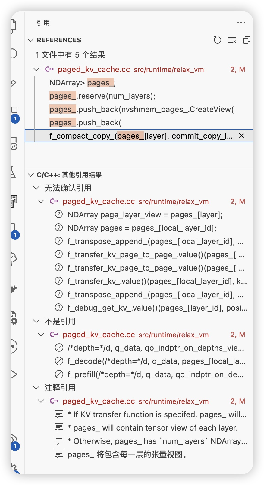

# tvm kv cache单元测试实现

从前文提到的单元测试里面进入
cache = create_kv_cache(head_dim, dtype, rope_mode, support_sliding_window)
这里的主要目的是构造一个初始化的AttentionKVCache,当然只是初始化了一堆参数以及很重要的注入了一堆函数的实现.

``` python
# 注入的代码实现 
        fattn_prefill,#10
        fattn_decode,
        fattn_prefill_sliding_window,
        fattn_decode_sliding_window,
        fattn_prefill_ragged,
        fmerge_state,
        fsplit_rotary,
        fcopy_single_page,
        fcopy_cache,
        fcompact_copy,
        fattn_prefill_with_tree_mask,
        fattn_prefill_with_tree_mask_paged_kv_cache,
```

注意这里注入的代码实现反倒是从上面的set_global_func里面获取的 可以更细的获取得到,貌似再 kv_cache.py里面

但是这里要注意这里的代码是 tir 下的

这里创建的 从 page_kv_cache.cc 中获取返回值是 class AttentionKVCache

``` c++

class AttentionKVCache : public KVState {
 public:
TVM_DEFINE_MUTABLE_OBJECT_REF_METHODS(AttentionKVCache, KVState, AttentionKVCacheObj);
};
```

因此后文代码中可以有KVState->调用
获取对应的 cache,这里

同时让我们看向 PagedAttentionKVCacheObj

``` c++

/ brief 用于注意力计算的分页键值（KV）缓存。
// 它支持管理 多个序列 的键值（K/V）数据。
// 它通过按照序列长度维度，以配置好的页面大小进行分页来管理键值（K/V）数据。
// 要向缓存中添加一个序列，使用 AddSequence 并提供一个唯一的整数序列 ID。
// 初始化后，在模型每一轮前向传播中，分页键值（KV）缓存的基本使用示例如下：
// 步骤 1. 使用 BeginForward 来指定序列 ID 列表以及要追加的长度。
// 步骤 2. 使用 Attention 传入与 BeginForward 中指定的序列和长度相关的查询（q）/ 键（k）/ 值（v）。注意力计算在输入查询与历史键值加上输入键值之间进行。输入键值也将被添加到键值（KV）缓存中。
// 步骤 3. 使用 EndForward 标记本轮前向传播结束。调用 EndForward 之后，在调用任何 Attention 之前，必须先调用 BeginForward。
class PagedAttentionKVCacheObj : public AttentionKVCacheObj {
//代码段注释还是很完善的

//基本上是一对相关的数据结构 和初始化方法 我挑出一些我觉得比较重要的内容

  /********************* Page Structures *********************/
//Page Structures
  /*!
   * \brief The KV data managed by the KV cache.
   * The array has `num_layers` NDArrays, each of them
   * has layout (num_pages, 2, num_heads, page_size, head_dim).
   * Along on the "2" dimension, index 0 stands for K and 1 stands for V.
   */
  Array<NDArray> pages_;
  /*! \brief The list of ids of released pages for page reuse. */
  std::vector<int32_t> free_page_ids_;
  /*! \brief The mapping from sequence ids to sequences. */
  std::unordered_map<int64_t, Sequence> seq_map_;

  /********************* Sequence Block Structures *********************/
//Sequence Block Structures block更小 page 更大
  /*! \brief 分配的 block 列表 */
  std::vector<Block> global_block_pool_;
  /*! \brief The list of free available blocks (in their indices). */
  std::vector<int32_t> free_block_idx_;

  /*********** Current Batch Info & Auxiliary Arrays on Device ***********/
  //Current Batch Info & Auxiliary Arrays on Device
  // 以下字段是设备上的辅助数组。
// 所有这些字段都可以直接从上述字段推导得出。
// 我们存储它们是为了高效执行注意力计算、缓存追加等操作。
bool dirty_aux_data_device_ = false;
  /*! \brief The batch size of the current round of forwarding. */
  int64_t cur_batch_size_;
  /*! \brief The ids of the sequences in the current round of forwarding. */

  //-------------------------------------------
  // Below are the auxiliary data structure on CPU.
  // We make them class members to avoid repetitive allocation time in BeginForward.
  //-------------------------------------------
  std::vector<HostMemoryVector> qo_indptr_on_depths_host_;

    //-------------------------------------------
  // Below are the auxiliary data structure on CPU.
  // We make them class members to avoid repetitive allocation time in BeginForward.
  //-------------------------------------------
  std::vector<HostMemoryVector> qo_indptr_on_depths_host_;

    //-------------------------------------------
  // 为实现高效的内存管理，上述数组的实际分配大小是超额的。
// 每次同步后，我们针对每个数组的实际形状创建一个视图，
// 并将这些视图作为注意力计算 / 追加操作的输入。
  NDArray cur_append_length_indptr_view_;
  NDArray k_ragged_rope_pos_offset_view_;
}

```

后面还有构造函数和对应的一些方法,有机会再去看

## test_paged_attention_kv_cache_prefill_and_decode

进入到第一个测试案例
test_paged_attention_kv_cache_prefill_and_decode

也就是预填写

``` python
# 注意这里代码  表明测试参数只是支持 gpu
@tvm.testing.requires_gpu
@tvm.testing.requires_cuda
def test_paged_attention_kv_cache_prefill_and_decode(kv_cache_and_config):
    # ``` 省略 这里是初始化一些语句方便测试

    for batch in operation_seq:
        # 这里是实现               
        apply_attention(kv_cache, rope_mode, batch, cached_k, cached_v)
```

apply_attention的实现里面我个人觉得因该腰关注前文注释提到BeginForward Attention EndForward

``
// 步骤 1. 使用 BeginForward 来指定序列 ID 列表以及要追加的长度。
// 步骤 2. 使用 Attention 传入与 BeginForward 中指定的序列和长度相关的查询（q）/ 键（k）/ 值（v）。注意力计算在输入查询与历史键值加上输入键值之间进行。输入键值也将被添加到键值（KV）缓存中。
// 步骤 3. 使用 EndForward 标记本轮前向传播结束。调用 EndForward 之后，在调用任何 Attention 之前，必须先调用 BeginForward。
``

然后可以观察到每一次再 for 循环里面计算Attention之后会同步检查计算结果

而在EndForward之后才会检查
验证缓存的键值对（cached_k 和 cached_v）与KV缓存中的数据是否一致
verify_cached_kv(kv_cache, seq_ids, cached_k, cached_v)

这里给一下BeginForward的EndForward
这里是先从 kv_state.cc中注册,然后再调用调用继承类AttentionKVCache的实现

``` cpp
TVM_REGISTER_GLOBAL("vm.builtin.kv_state_begin_forward")
    .set_body([](TVMArgs args, TVMRetValue* rv) {
      CHECK(args.size() == 3 || args.size() == 4)
          << "KVState BeginForward only accepts 3 or 4 arguments";
      KVState kv_state = args[0];
      IntTuple seq_ids = args[1];
      IntTuple append_lengths = args[2];
      Optional<IntTuple> token_tree_parent_ptr{nullptr};
      if (args.size() == 4) {
        token_tree_parent_ptr = args[3].operator Optional<IntTuple>();
      }
      kv_state->BeginForward(seq_ids, append_lengths, token_tree_parent_ptr);
    });
TVM_REGISTER_GLOBAL("vm.builtin.kv_state_end_forward")
    .set_body_method<KVState>(&KVStateObj::EndForward);

```

这里给出实现代码太长了,因此采用外部文件的引入

<details>
<summary><font size="4" color="black">Show Code</font></summary>
<pre><code class="language-cpp">@import "./begin.cc"</code>
</pre> </details>

我盟现在进入计算 attention 的核心

attention_kv_cache_attention_with_fused_qkv

这个也是注入到

``` c++
fattention_with_fuse_qkv = tvm.get_global_func(
    "vm.builtin.attention_kv_cache_attention_with_fused_qkv"
)
```
和上面函数一样,也是从 kv_state.cc里面注册

```cpp

TVM_REGISTER_GLOBAL("vm.builtin.attention_kv_cache_attention_with_fused_qkv")
    .set_body_typed([](AttentionKVCache kv_cache, int64_t layer_id,
                       double attn_score_scaling_factor, NDArray qkv_data, NDArray o_data) {
      kv_cache->AttentionWithFusedQKV(layer_id, std::move(qkv_data), NullOpt, std::move(o_data),
                                      attn_score_scaling_factor);
    });

```


在 TVM（Tensor Virtual Machine）中，NDArray::CreateView 函数用于基于现有的 NDArray 创建一个新的视图。这个视图与原始的 NDArray 共享底层的数据存储，但具有不同的形状（shape）、数据类型（DLDataType）和相对字节偏移（relative_byte_offset）。


_kv_cache_transpose_append

这个函数的实现在 kv_cache.py
的 tir方法里面

``` python
def _kv_cache_transpose_append(num_key_value_heads, head_dim, dtype):
    """Return the TIR function that appends new k/v data to PagedKVCache."""

    # pylint: disable=line-too-long
    # fmt: off
    @T.prim_func
    def tir_kv_cache_transpose_append(
```

没看到管理的内容

感觉可以根据块的管理的逻辑的代码来查看

根据 //Page Structures和 block structrue来实现

```c++
      //注意再这里进行构造函数 里面构造
      nvshmem_pages_ = (*f_nvshmem_empty)(
          ShapeTuple({num_layers, num_total_pages, 2, num_kv_heads, page_size, head_dim}), dtype,
          device);
      for (int i = 0; i < num_layers; ++i) {
        pages_.push_back(nvshmem_pages_.CreateView(
            {num_total_pages_, 2, num_kv_heads_, page_size_, head_dim_}, nvshmem_pages_->dtype,
            i * num_total_pages_ * 2 * num_kv_heads_ * page_size_ * head_dim_ *
                nvshmem_pages_.DataType().bytes()));
      }
```

## tvm Disco
https://discuss.tvm.apache.org/t/rfc-unity-relax-distir-compilation-pipeline/15600


Disco 43
A Framework-Agnostic SPMD Runtime for Distributed Inference/Training. It is a single-controller system which consists of a controller and a group of workers, the controller broadcasts commands to all workers who then executes the commands. The single-controller architecture provides tremendous programmability because it enables programmers to write distributed code just like centralized code.

## 初始化内存

这里因该是使用了 cuda 的分布式内存库


## page 管理



注意这里的num_total_pages

可以依托这个来实现对应的效果

根据这个来构造对应的代码

明天可以好好想想这个


free_page_ids_这个数据结构用到了么??


看起来slide_window也要用到这个核心逻辑

所有free_page_ids_的地方估计都需要

另外 request 是不是 对应sequences?这样我的逻辑里面走 request 是不是从 sequence从这个走


## 调度器

基于三个状态的队列函数,是否适合对应的代码?


参考 vllm 写一个调度器,核心在于什么时候唤起调度器

```
首先，我们明确了vLLM最重要的推理内核引擎是LLMEngine
LLMEngine下有两个最重要的方法：add_request()和step()
add_request()负责将每个prompt都包装成一个SequenceGroup对象，送入调度器的waiting队列中等待调度
step()负责执行1次推理过程，在这个过程中，调度器首先决定哪些seq_group可以被送去推理，然后model_executor负责实际执行推理。
```

参考这里,选择什么时候处理这个 step,插入对应的方法

核心再 promote 抢占函数目前暂时不想做对应的重新计算的代码


## test_paged_attention_kv_cache_prefill_and_decode逻辑

从 python 那里,构造

包括一些列序列的情况,主要是prefill 阶段的下一些列 batch

和 decode 下一系列 batch

batch 的情况,主要是

```python
 # 这里 第一个是 seq_id 第二个是序列长度 第一是基本初始化 第二轮到第二次的时候只是填入不同的情况 之后也可 prefill 也是乱序
    operation_seq = [[(0, 6)], [(1, 8)], [(2, 11)], [(3, 16)], [(4, 19), (5, 20)]]
    operation_seq += [[(6, 21), (7, 24)], [(2, 5), (4, 7), (8, 24)]]
    operation_seq += [[(6, 13)], [(8, 19)], [(0, 1)], [(1, 3), (3, 8), (5, 12), (7, 11)]]
    # Decode 因为是 decode,所以每一次只是输入 1
    operation_seq += [[(0, 1), (1, 1), (2, 1), (3, 1), (4, 1), (5, 1), (6, 1), (7, 1), (8, 1)]]
    operation_seq += [[(0, 1), (1, 1), (2, 1), (3, 1), (4, 1), (5, 1), (6, 1), (7, 1), (8, 1)]]
    operation_seq += [[(0, 1), (2, 1), (4, 1), (6, 1), (8, 1)]]
    operation_seq += [[(4, 1), (5, 1), (6, 1), (7, 1), (8, 1)]]
```

构造之后进入 python 里面进行处理,主要是构建 seq 序列,和对应的append_lengths序列

这里可以看到代码里面并没有对应的进入的 token

同时会再构建 token树的时候调用AddSequence
添加 sequence

``` c++
     void AddSequence(int64_t seq_id) final {
    CHECK(seq_map_.find(seq_id) == seq_map_.end())
        << "The sequence \"" << seq_id << "\" is already in the KV cache.";
    int32_t block_idx = GetFreeBlock();
    //Sequence构造的时候会触发 ++global_block_pool->at(last_block_idx).external_ref_cnt;
    seq_map_.insert({seq_id, Sequence(&global_block_pool_, block_idx)});
    dirty_aux_data_device_ = true;
  }

    /*! \brief Get a new free block and return its index. */
  int32_t GetFreeBlock() {
    if (!free_block_idx_.empty()) {
      int32_t block_idx = free_block_idx_.back();
      free_block_idx_.pop_back();
      global_block_pool_[block_idx].Reset();
      ICHECK_EQ(global_block_pool_[block_idx].index, block_idx);
      return block_idx;
    }

    int32_t block_idx = global_block_pool_.size();
    global_block_pool_.push_back(Block(block_idx));
    return block_idx;
  }
```
注意,根据我的观察,global_block_pool_ 好像 push_back只有这里

但是目前看到的调用只有 addSquence 和 forkSequence

进入 forwar


一系列初始化
包括    sequences和检查 seq_map  last_block_length_before_append
    std::vector<Sequence*> sequences;
    std::vector<int32_t> last_block_length_before_append;

包括这里的处理 block

```
    for (int d = 0; d < num_depths_; ++d) {
        // 获取分块后的块ID以及是否使用解码内核的标志
        // 对于最大深度的块，不进行合并，以便与尾随的超出块进行连接
        auto [chunked_block_ids, use_decode_kernel] = GetChunkedBlockIds(
            block_ids_on_depths[d], /*enable_coalesce=*/d!= kPagedKVCacheMaxBlockDepth - 1);
        // 将分块后的块ID添加到chunked_block_ids_arr中
        chunked_block_ids_arr.push_back(chunked_block_ids);
        // 将是否使用解码内核的标志添加到use_decode_kernel_中
        use_decode_kernel_.push_back(use_decode_kernel);
    }

```

```
   // 如果在注意力计算前进行追加操作
    if (append_before_attn_) {
        // 当前在深度为1和不为1时使用不同的内核
        // 对于最大深度为1的情况，在追加后创建与页表相关的辅助数据结构
        for (int i = 0; i < cur_batch_size_; ++i) {
            // 为当前序列预留追加长度
            ReserveAppendLengthInSeq(sequences[i], append_lengths[i]);
        }
    }

```


## 拆分实现

- GetFreeBlock 和对应的global_block_pool_拆分到物理块里面

这样 remove_seq 和 add_seq的逻辑就没有问题

只是这样再 add_seq就要修改对应的构建代码,把一个对应的物理块添加到对应 seq 的逻辑块里面去

free_page_ 放到物理?

-- Struct Sequence 改成
last_block_idx 改成逻辑块  
是否要改成对应的 vector?

--- page__

 pages_.push_back(
            NDArray::Empty({num_total_pages, 2, num_kv_heads, page_size, head_dim}, dtype, device));


是否是以 page_为核心构建物理 page__ 从而关联到物理块?

还有一些列辅助的数组
包括 page__这些?先放到物理块里面去?

int64_t num_total_pages = (total_token_capacity + page_size - 1) / page_size + 1;


添加一个额外的结构

物理块结构

逻辑块结构

seq 内 通过last_block_idx 改成逻辑块 

全局结构内改成

self.block_tables：负责维护每个seq下的物理块列表，本质上它是一个字典，形式如{seq_id: List[PhysicalTokenBlock]}。注意，这个字典维护着【所有】seq_group下seq的物理块，而不是单独某一个seq的。因为调度器是全局的，所以它下面的的BlockManager自然也是全局的

这样结构似乎是没有问题

每一次操作的时候只要保证传入的都是物理块就不需要修改现有的代码?

是否存在写时复制机制?

看一看对应的 ref_count

不存在,另外 copy 的逻辑有点意思

可以继续看


addSequece 和 remove 的时候都会触发

但是 forward得时候触发?

再仔细看看forewarded的逻辑

3. 块信息处理
获取块 ID：调用 GetBlockIdsOnDepth 函数，获取每个深度的块 ID 列表以及尾随块信息。
确定最大深度：计算并记录最大深度 num_depths_，确保其不超过允许的最大值。
块 ID 分块：对每个深度的块 ID 进行分块处理，除最大深度外，其他深度允许合并块。记录每个深度是否使用解码内核。

GetBlockIdsOnDepth这里和之后的调用处理,要涉及到逻辑块和物理块的之间的转化问题

```

add_request()负责将每个prompt都包装成一个SequenceGroup对象，送入调度器的waiting队列中等待调度


step()负责执行1次推理过程，在这个过程中，调度器首先决定哪些seq_group可以被送去推理，然后model_executor负责实际执行推理。`


waiting队列用于存放所有还未开始做推理的seq_group，“未开始”指连prefill阶段都没有经历过。所以waiting队列中的seq_group只有一个seq，即是原始的prompt。
running队列用于存放当前正在做推理的seq_group。更准确地说，它存放的是上1个推理阶段被送去做推理的seq_group们，在开始新一轮推理阶段时，调度器会根据本轮的筛选结果，更新running队列，即决定本轮要送哪些seq_group去做推理。
swapped队列用于存放被抢占的seq_group。在2.2节中我们有提过，若一个seq_group被抢占，调度器会对它执行swap或recomputation操作，分别对应着将它送去swapped队列或waiting队列，在后文我们会详细分析抢占处理的代码

```

```
vLLM调度器维护的重要属性如上图所示：

包括三个队列等等 信息
https://zhuanlan.zhihu.com/p/692540949

BlockAllocator：物理块分配者，负责实际为seq做物理块的分配、释放、拷贝等操作。这也是我们后文要解读的对象。其下又分成self.gpu_allocator和self.cpu_allocator两种类型，分别管理gpu和cpu上的物理块。
self.block_tables：负责维护每个seq下的物理块列表，本质上它是一个字典，形式如{seq_id: List[PhysicalTokenBlock]}。注意，这里维护者【所有】seq_group下seq的物理块，而不是单独某一个seq的。因为整个调度器都是全局的，其下的BlockManager自然也是全局的。

每个Sequence实例中维护着属于这个seq的逻辑块吗？而我们从self.block_tables中，又能根据seq_id找到这个seq对应的物理块。这就实现了“逻辑块 -> 物理块”的映射。
```


```
seque 还包括状态 waiting running swap
若干和Finish相关的状态，表示该seq推理已经结束，具体包括：
FINISHED_STOPPED：正常执行完毕，例如碰到<eos>符号，该seq的推理正常结束了
FINISHED_LENGTH_CAPPED：因为seq的长度达到最大长度限制，而结束推理
FINISHED_ABORTED：因不正常状态，而被终止的推理。例如客户端断开连接，则服务器会终止相关seq的推理
FINISHED_IGNORED：因prompt过长而被终止执行的推理。本质上也是受到长度限制
```
```
waiting队列中的数据都没有做过prefill，每个seq_group下只有1个seq（prompt）
running队列中存放着上一个推理阶段被送去做推理的所有seq_group
swapped队列中存放着之前调度阶段中被抢占的seq_group
```
因此对应下来就是
调度器部分

```
参考图片

不过要注意队列 是再循环处理

当LLMEngine开始执行1次调度时（step），调度器策略(Scheduler)会选择要送哪些seq_group去做新一轮推理。注意，在1次推理中，所有seq_group要么一起做prefill，要么一起做decode。

```
-- 疑问  为什么这里prefill 和 decode 的分配逻辑不一样

再 add_seq 的时候把对应的队列加入到对应刀 wait_list

再 pre_ward的时候进行处理

注意是否和 tvm 的逻辑一直,因为 tvm 中是否是 prefill和 decode 混杂

## tvm 内存分配

这里似乎是固定分配?
